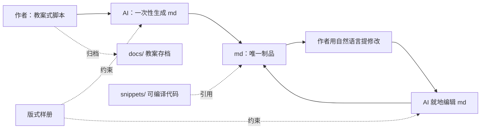

# 课件制作流程规范

> **状态**：已通过一轮外部专家评审；已完成两轮实测——ch01 第 2 次课验证代码资产方案，ch00 导论验证端到端全流程（988 行底稿 → 39 页 / 70 分钟）。**核心机制全部成立，规范主体不变**，逐项结论见 §13，对规范的具体影响见附录 C。
> **适用范围**：本仓库全部章节课件的编写、生成与维护
> **配套约定**：目录结构与资源引用规范见根目录 `README.md`；面向内容作者的操作指南见 `lesson-draft-guide.md`

---

## 1. 背景与要解决的问题

本项目用 Slidev（Markdown + Vue + UnoCSS）制作《现代Web开发技术》课件，规模预期为十余章、数十次课、数百页，需长期维护与逐年迭代。

Slidev 表达力强、可交互、可版本管理，但其 md 对**内容作者（教师）**不友好。对已完成的第 1 章做负担归因，问题并不在 Markdown 本身：

| 负担来源 | 实际形态 | 心智成本 |
| --- | --- | --- |
| 布局脚手架 | `<div grid="~ cols-2 gap-4">` + 手动配平两列 | 最高 |
| 动画时机 | `v-click` / `v-after` / 代码高亮编号 `{all\|3\|4}` | 高 |
| 样式 class | `p-3 rounded border border-green-500/30` | 高 |
| 分页决策 | `---` 放哪、这页会不会溢出画布 | 高 |
| 图示语法 | mermaid / SVG 细节 | 中 |
| **正文文字** | `- **有穷性** — 有限步后结束` | **近乎为零** |

**结论**：要替作者免掉的是前五项，不是最后一项。

---

## 2. 核心原则

### 原则一：结构形式化，意图留自然语言

只形式化极少的结构（哪个知识点、哪段是正文/代码/图/讲稿）；凡"希望这里怎么呈现"一律用中文散文表达，**不发明标记语法**。

形式化可以碰**结构**，绝不能进入**内容**。参照 `.ipynb`：它确实有 schema，但被形式化的只有外层单元格结构，单元格内容完全自由——边界正应划在此处。

### 原则二：取消程序性消费者

中间格式膨胀成 DSL 的机制是固定的：

> 程序要解析它 → 需要 schema → 有 schema 就有校验 → 校验为"再加个字段"提供了自然位置

反面先例：DocBook / DITA 的元数据爆炸、各家 CMS 自制内容格式。正面先例：Markdown、Org-mode、Jupyter——共同点是**人可读、宽容、错了也能跑**。

因此边界不靠"设计克制"（会随人员与时间衰减）来守，而靠**根本不存在程序性消费者**：脚本的唯一读者是 AI，一个宽容的读者。

---

## 3. 流程总览

作者写一份**教案式脚本**（按知识点组织、含讲稿）→ AI 一次性生成该次课的 Slidev md → **脚本归档，md 成为唯一制品** → 此后所有修改由作者用自然语言提出、AI 在 md 上**就地编辑**。



---

## 4. 五条硬规则

1. **不写转换器。** 禁止任何解析脚本的程序、schema、校验器。这是本项目的**明确反需求**，不是"暂时不做"。
2. **形式化只到结构，不进入内容。** 识别不了的段落一律当正文；字段缺失就推断；**永不报错、永不要求作者回去改格式**。
3. **md 是唯一制品。** 脚本一次性使用后归档并标注"不再更新"；一切后续修改走就地编辑，**不重新生成**。
4. **可运行的算法实现必须外置**到 `snippets/`，slides 用 `<<<` + region 引用。伪代码、反例、极短片段内联；代码演变动画（magic-move）内联。
5. **长代码不拆页。** 用 `maxHeight` + 逐步高亮，让整个算法留在同一页、同一份代码上。

---

## 5. 角色分工

| 事项 | 归属 | 说明 |
| --- | --- | --- |
| 教学内容与顺序 | 作者 | 讲什么、讲多深、先后次序 |
| 知识点划分与拆分 | 作者 | 属教学编排职责，见 §7 |
| 教学意图 | 作者 | "这两者必须并排对比"、"这三步要逐条揭示" |
| 讲稿 / 备注 | 作者 | 几乎原样进入 `<!-- -->` 演讲者备注 |
| 硬分页要求 | 作者 | 仅在分页本身有教学含义时行使，见 §8 |
| 分页 | AI | 默认归 AI，作者事后否决 |
| 版式与视觉实现 | AI | `layout` / `grid` / `v-click` / class / 配色 |
| 图示绘制 | AI | 作者只给语义描述或数据 |
| md 就地编辑 | AI | 作者永不需要手写 Slidev 语法 |

分工线可概括为：**作者定教学意图，AI 定视觉实现。**

---

## 6. 脚本写法

> 面向内容作者的操作层指南另见 [lesson-draft-guide.md](lesson-draft-guide.md)（基于 ch00 实测编写，含交付前自查与"意图→实现"对照）。本节只定原则。

不提供字段清单——字段表天然邀请"填满/补全"，本身就是膨胀的种子。**照下面的范例模仿即可**：

```markdown
---
章: 第1章 绪论
次课: 2
标题: 算法与算法分析
时长: 90min
---

## 1.2.3 大 O 表示法
时长: 12min
要求: 定义式和三条推导规则要同屏，学生会边看规则边套公式

内容:
定义：若存在正常数 c 和 n0，使 n ≥ n0 时 T(n) ≤ c·f(n)，则记 T(n) = O(f(n))
三条推导规则：1. 用常数 1 取代加法常数 2. 只保留最高次项 3. 去掉系数

表格: n 取 10 / 1000 / 10⁶ 时 logn、nlogn、n² 各是多少，用于看数量级差距

讲: 10¹² 换算成时间——每秒 10⁹ 次运算要 17 分钟，而 O(nlogn) 只要 0.02 秒。
```

三条说明，仅此而已：

- 知识点标题带**稳定编号**（用途见 §7）
- 除 `内容:` 外一切都可省略
- `要求:` 里用中文写任何意图，包括"这页单独放"这类硬分页需求

图与表只写**语义描述或数据**（如"单链表，A→B→C，末端指向 NULL"），画法归 AI。

### `讲:` 字段是关键护栏

它让脚本拥有脱离 AI 的独立生命——**脚本本身就是教案**。因此作者不会产生"在给机器填表"的感觉，这是格式能被长期使用的心理基础，也是防止格式滑向 DSL 的实质约束。

---

## 7. 知识点：写作单位与拆分尺度

**写作单位是"知识点"，不是"页"。** 作者按知识点写，写多长算多长；一个知识点可能被渲染为 1 页、2 页，或 1 页多次点击揭示。

理由：按页写作要求作者预估版面容量，而容量信息（主题字号、行高、16:9 余量）只有生成端掌握；结果是作者为"凑一页"而增删内容——**内容密度不该被版面绑架**。

### 拆分的软上限

> 单个知识点**讲授时间超过 ~10–15 分钟**，或**要点超过 ~8–10 条**，就应拆成两个知识点。

刻意不用"页数"作尺度：那会把作者重新拽回估算版面。时长与要点数是教师备课时天然会想的量，且与页数强相关，语义等价而无需任何版面直觉。

拆分属于**教学编排职责**，不是版面妥协。

### 稳定编号的用途

- 审阅与讨论时可指称（"1.2.3 这个点太长"）
- md 中留锚点，便于 AI 就地编辑定位
- 成品课件与归档教案的追溯对应
- 跨章互引（"回顾 1.2 的结论"）

---

## 8. 分页规则

分页权归 AI，配三项机制：

**① 分页清单回报。** 生成时随 md 交付一份清单，作者扫一眼即可否决：

```
第2次课 · 6 个知识点 → 11 页
  算法的定义与特性     → 1 页
  如何度量时间开销     → 2 页（"两种度量法"与"语句频度"拆开）
  大 O 表示法          → 1 页（3 次点击揭示）
  复杂度实例           → 2 页（5 个例子 3+2 分）
```

**作者保留否决权，但不承担决策成本。**

**② 硬分页逃生门。** 分页偶有教学含义（留白让学生思考），作者可在 `要求:` 中显式指定。**默认归 AI、例外归作者，不可反向。**

**③ 溢出机械验证。** 生成后渲染截图逐页检查是否超出画布，不靠人肉试错。

ch00 实测确立的可行做法（`pnpm export` 需先装 `playwright-chromium`，未装时走这条）：启 dev server，用系统 Playwright 缓存里的 Chrome for Testing 以 `--headless --screenshot` 逐页截 `?clicks=999`（展开全部动画），再用脚本检测每张图画布四边是否有内容。两点经验：截图必须自己做——**仅靠浏览器内 JS 读 `getBoundingClientRect` 不可信**，Slidev 缩放变量在非可见状态下为 0，边界数据全是 0；`--headless=new` 写不出文件，须用 `--headless`。

---

## 9. 版式库

### 定位

版式库是**下限保障（防止同类页在章节间风格漂移），不是上限约束（不限制表达能力）**。约定的是"同类页至少长得一样"，**不是"只能用这些"**。

### 生长规则

- **不预先设计**。自上而下臆造一套清单会变成笼子——AI 会就近套用最像的版式，最终得到整齐但平庸的课件，抵消使用 Slidev 的意义。
- 从已完成章节**归纳**。
- 某版式**第二次被实际用到时才登记入库**。"用过才入库"可有效阻止臆造。

### 分层

| 类别 | 数量 | 要求 |
| --- | --- | --- |
| 常规讲授页 | 多数 | 用库、求一致，降低学生认知负担 |
| 高光页 | 每次课 1–2 个 | 核心可视化或关键对比，**刻意突破版式** |

一致性目标是"同类一致"，不是"全书同质"。

### 抽象时机

先只做**参考样册 + 命名约定**；某版式稳定复用 3 次以上，再考虑抽成 Vue 组件或自定义 layout。**过早抽成组件才是真正锁死表达的动作。**

### 已登记版式

按上述规则登记（"用过两次才入库"）：

**① 章节封面**（ch00、ch01 各用一次后登记）

每章封面（`chXX.md` 首屏，seriph 主题 `cover` 布局）统一沿用同一视觉，新增章节时照抄 ch00.md 封面写法即可：

- headmatter 固定写 `background: /images/common/jr-korpa-3XXSKa4jKaM-unsplash.jpg`——全课共用同一张背景图，逐章复用；**不得依赖主题自带的随机 Unsplash 占位图**（源已失效）。frontmatter 路径必须为 `/` 开头的绝对路径（同 README 约定）
- 组合标志（combination mark）居中于标题上方，类名固定含 `invert brightness-0` 反白：背景为暗色图，且 seriph `cover` 布局对 `background` 自动叠加暗色渐变（`#0005 → #0008`）并强制文字变白，深蓝原色标志在图上不可读
- 标题、副标题、按键提示等元素沿用既有写法，文字变白由布局自动完成，无需手动设置

机制备注（防止误用到其他版式）：`background` 是作为 prop 传给布局组件的，**只有消费该 prop 的布局才有背景效果**——seriph 的 `cover` 支持；`section` / `default` / `center` / `full` 均不支持。故该约定仅适用于封面；正文若要铺底需自建消费 `background` 的自定义布局，不属本规范。

配套约定：非封面、非整屏页的右上角校徽角标由全局层 `slide-bottom.vue` 统一提供（36px、opacity-40），封面与 `full` 页自动排除——正文页的机构标识统一走该层，不在单页里散落徽标。

---

## 10. 代码资产规范

### 硬规定与边界

| 代码类型 | 处理方式 |
| --- | --- |
| 可运行的算法实现 | **必须外置**到 `snippets/chXX/`，用 `<<<` + region 引用 |
| 伪代码、故意写错的反例 | 内联（无法编译，外置只增加跳转成本） |
| 三五行的极短片段 | 内联 |
| 代码演变动画（magic-move） | **只能内联**（技术限制，见下） |

外置的收益远超"省事"：代码可编译、可写测试验证算法正确性、可直接发给学生、多页引用同一份实现（改一处全部生效）、md 显著变短从而更适合 AI 就地编辑。对"代码即内容"的《现代Web开发技术》课程，这是硬规定。

### 写法

外置文件用 VS Code region 注释式标记分段（本项目 `snippets/external.ts` 已在使用该风格）：

```c
// #region insert
/* ... 算法实现 ... */
// #endregion insert
```

slides 侧引用，可叠加 region、逐步高亮、行号与滚动高度：

```
<<< @/snippets/ch01/algo.c#insert {*}{lines:true,maxHeight:'380px'}
```

`@` 指向项目根目录。

### 长代码不拆页

`maxHeight` 可与逐步高亮组合（`{3|5|8}{maxHeight:'380px'}`），使整个算法留在同一页、同一份代码上，讲到哪高亮到哪，学生不必在两页之间做心智拼接。

### 已核实的能力与限制

基于本项目 Slidev v52.19：

- ✅ `maxHeight` 与逐步高亮可组合
- ✅ `<<<` 外置引用支持 region、行高亮、行号、maxHeight 叠加
- ✅ **"讲到哪滚到哪"已实测成立**（ch01 第 2 次课）：`maxHeight` 受限的代码块随逐步高亮自动滚动，高亮行保持可见。官方文档未明确承诺该行为，**升级 Slidev 版本后需重测**
- ✅ `.c` 文件中的 `// #region name` 标记可被正确识别，构建产物只含 region 内容
- ❌ magic-move 要求多个**内联**围栏代码块，不支持 `<<<` 导入

因此"逐步演变讲解"与"代码外置"互斥。建议：演变讲解用内联简化版，最终完整实现用外置引用，两者指向同一算法。

### 维护风险

外置后行高亮使用的是 **region 内相对行号**，代码一改行号即失配，且是**静默失效**（不报错，只是高亮错行）。

**缓解：优先用细粒度 region 分段引用，尽量避免裸行号。** region 名是语义锚点，改代码不会失配。

---

## 11. 生命周期与所有权

### md 是唯一制品

不采用"脚本长期作为源头 + 定点重新生成"的模式。原因：

- 双源头必然失同步——作者难免直接改 md，几次之后脚本失维护，流程作废
- 任何需要人持续"守规矩"的设计终将腐坏
- AI 生成不可复现，重新生成某页可能顺带改动他页版式

**原始目标未被牺牲**：作者依然不必碰 Slidev 语法——因为修改由 AI 在 md 上就地执行。作者说"这页拆成两页"、"这里加个反例"，AI 去改 `grid` 与 `v-click`。"免除脚手架负担"这一目标由**AI 承担编辑**来实现，而非由**脚本保持源头**来实现。

### 归档规则

- 脚本首次生成 md 后即归档到 `docs/`（README 已定义该目录为讲稿/教案初稿，不参与构建）
- **文件头必须显式标注**：`已归档 / 不再更新 / 以 md 为准`。否则日后有人误将脚本当作源头，不一致会以新形式回来
- **归档 ≠ 删除**。残余价值：教案、备课复用、给学生的提纲、下一轮开课的起点

### 已知代价

日后更换主题或框架时，无法靠脚本重跑重制。但非确定性生成本来也做不到可靠重制，且 md 是纯文本、迁移可从 md 出发。代价可接受。

---

## 12. 一致性体检（替代重新生成）

单制品 + 只增量编辑的模型失去了"重新生成"所提供的**重置能力**，md 可能在反复就地编辑后结构熵增、风格漂移。

缓解手段：**每完成一章，让 AI 通读全章 md，只做一致性修复**——版式归一、class 收敛、清除孤立的临时 hack，**不改内容**。这保留了重置能力，又不违反"不重新生成"原则。

这也再次说明版式样册的价值：**它是体检的判据**，没有它就无法判断什么叫"不一致"。

---

## 13. 验证状态与已知风险

### 已验证

| 项目 | 结论 | 证据 |
| --- | --- | --- |
| `.c` 文件中的 region 标记能否被识别 | ✅ 成立 | `snippets/ch01/algorithm-analysis.c` 用 `// #region mul` 式标记分 4 段，构建产物中只含 region 内容，`main()` 与标记行均未泄漏 |
| 代码外置 + `maxHeight` + 逐步高亮可否叠加 | ✅ 成立 | `pages/ch01/02-algorithm-analysis.md:76`：`<<< @/snippets/ch01/algorithm-analysis.c#mul {all\|6\|7\|8\|10\|all}{lines:true,maxHeight:'110px'}` |
| 高亮行的自动滚动 | ✅ 成立（**绑定 v52.19**） | ch01 实测：`maxHeight` 受限的代码块会随逐步高亮自动滚动，使高亮行保持可见。行为未见于官方承诺，**升级 Slidev 后需重测** |
| 就地编辑能否吸收全部返工 | ✅ 成立 | ch00 全程一次生成 + 数十轮就地编辑，含整块图示重做（柱状图重构）、整块图示换技术路径（SVG → HTML）、跨页批量属性改写，**无一次需要重新生成**；§11 模型的关键验证点通过 |
| 溢出的机械验证是否可行 | ✅ 成立，但手段与预想不同 | 见 §8 ③——`pnpm export` 因 playwright 未安装不可用，改走 dev server + 无头截图 + 像素级边界检测，39 页全过 |
| 归档底稿脱离 AI 后的独立可用性 | ✅ 成立 | ch00 底稿含完整 `讲:` 字段，归档后可直接当教案用；`讲:` 作为护栏的设计意图（§6）得到验证 |
| 意图 / 实现分离是否可操作 | ✅ 成立 | ch00 底稿全篇无一处版面指令，成稿仍产出 12 处显式 `layout`、8 处圈注高亮、106 处讲稿与点击的同步切分 |

### 待验证 / 缺数据

| 项目 | 状态 | 说明 |
| --- | --- | --- |
| 单页平均作者耗时 | **无数据** | 底稿由教师离线编写，未计时。这是四条成功判据中唯一完全没有数据的一条 |
| 生成结果返工率 | 定性有、定量无 | ch00 的返工集中在图示（3 处大改），文字与结构几乎无返工。但样本只有 1 章，且导论是无代码章节，不代表算法章 |
| 长期就地编辑后的结构熵增 | 仍是风险 | ch00 只经历一章的编辑量，不足以观察熵增。缓解手段（§12 一致性体检）**本身仍未验证** |
| ROI 是否成立 | 无法判定 | 缺作者耗时数据；且导论篇幅特殊（无代码、图示密集），不宜据此外推 |

### 已知风险

| 风险 | 类型 | 缓解 |
| --- | --- | --- |
| AI 版式选择的非确定性 | 原有 | §9 版式库。ch00 后已有可归纳的素材：`center` ×8、`section` ×2、`full` ×2（高光页），但按"用过两次才入库"规则，仍需第二章佐证才登记 |
| region 行号失配静默失效 | 原有 | §10：优先细粒度 region，避免裸行号 |
| **底稿改稿后的交叉引用残留** | **ch00 新发现** | 教师删除两个单元后，讲稿仍写"清单五项"而表格只剩四行，附录一道题仍引用已删小节。**这类矛盾会被原样带进课件**。已写入 `lesson-draft-guide.md` §7 交付前自查 |
| **图数量失控** | **ch00 新发现** | 底稿列出 30 余张图，远超单章可交付量。解法是让作者分三档优先级（必须有／可后补／留占位手画），已写入 `lesson-draft-guide.md` §5 |
| **内联 SVG 在 UnoCSS attributify 下不可控** | **ch00 新发现** | `font-size="12"` 被当作工具类放大约 4 倍；`<text>` 配 `fill="currentColor"` + `opacity=` 时整段不渲染。已定项目约定：结构图用 HTML 拼，SVG 只画曲线与多边形。详见 `README.md` |
| **`pnpm export` 开箱不可用** | **ch00 新发现** | `playwright-chromium` 未在依赖中，导出 PDF 前需手动安装。不影响构建与放映 |

### 成功判据达成度

| 判据 | 达成 |
| --- | --- |
| 单页平均作者耗时 | ⬜ 无数据 |
| 生成结果返工率 | 🟡 定性可接受（返工集中在图示），无定量 |
| 同类页版式一致性 | ✅ 39 页构建无警告、逐页溢出检测全过、同类页版式收敛 |
| 归档底稿的独立可用性 | ✅ 可直接当教案用 |

**总体判断**：**流程可用，可继续用于后续章节。** 唯一尚未受检的部分是"含大量可运行代码的算法章"在端到端流程下的表现——ch00 是无代码章节，ch01 只验证了代码资产的技术可行性，两者未合并跑过一轮。**建议下一次端到端试验选一个算法密集的次课。**

---

## 14. 落地步骤

1. ✅ **实测代码方案**（已完成，ch01 第 2 次课）：C 代码已外置到 `snippets/ch01/algorithm-analysis.c`，用 region 引用改写，`maxHeight` + 逐步高亮 + 自动滚动与 `.c` 中 region 识别均已实证。
2. ⬜ **从已完成章节归纳版式样册**：待第二章完成后动手。ch00 已产出候选（`center` / `section` / `full` 三类显式版式、单元导航条组件 `UnitNav.vue`），但按 §9"用过两次才入库"，现在登记为时过早。
3. ✅ **一次课端到端试验**（已完成，ch00 导论）：作者按 §6 写底稿 → 一次生成 → 全部修改走就地编辑，返工被完整吸收。据此产出面向作者的 `lesson-draft-guide.md`，并修订 §13、附录 C。
4. ⬜ **算法密集次课的端到端试验**：ch00 无代码、ch01 未走完整流程，"代码资产 + 端到端"的组合尚未受检，这是当前最大的未知。

原则：**不追求先把格式定完再开始，一轮实测胜过十轮设计。**

---

## 附录 A：v1 → v2 变更记录

| 删除项 | 原因 |
| --- | --- |
| 双阶段所有权（内容期 / 打磨期） | 需要人持续执法的设计会腐坏；单制品从根上消灭同步问题 |
| 按知识点"定点重新生成" | 非确定性风险；就地编辑成本更低 |
| "改内容→动脚本，改样子→动 md"口诀 | 随双阶段模型一并作废 |
| 预先设计的 8 种版式清单 | 自上而下臆造会成为笼子；改为归纳 + 用过两次才入库 |
| 脚本字段表 | 字段表本身邀请膨胀；改为范例式呈现 |
| "容量预算公开给作者" | 作者不再需要版面直觉；改用时长/要点数的教学尺度 |

**保留**：知识点为写作单位、分页归 AI（含清单回报与硬分页逃生门）、意图/实现分离、`讲:` 字段、渲染截图验证溢出。

**新增**：不写转换器（反需求）、宽容规则、代码外置硬规定、长代码不拆页、一致性体检。

## 附录 B：专家评审意见采纳情况

| 评审意见 | 处置 |
| --- | --- |
| 边界靠"取消程序性消费者"而非设计克制 | **完全采纳**，升级为硬规则 1，并据此删除字段表、新增宽容规则 |
| 双阶段所有权不现实，改为 md 唯一制品 + 一次性草稿 + 就地编辑 | **完全采纳**，重写 §11，连带删除定点重新生成 |
| 版式库需逐步完善，不宜限制表达能力 | **完全采纳**，重写 §9：改为归纳式生长、用过两次才入库、分层、延后抽象 |
| 知识点粒度恰当，加稳定 id 与软上限 | **采纳并修正表述**：软上限改用时长/要点数而非页数，避免作者重新承担版面估算 |
| 代码可滚动 + 高亮自动滚动 | **采纳**，升级为硬规则 5；自动滚动行为当时列为待实测，**现已实测成立**（见 §13） |
| 代码外置为硬规定 | **采纳并补两条边界**：不可编译的代码不外置；magic-move 只能内联。另登记行号失配风险 |

补充说明：稳定 id 的**理由**已变更——原为"便于定点重新生成"，该用途随 §11 取消；现用途见 §7。

---

## 附录 C：ch00 端到端实测对本规范的影响

**结论先行：规范主体未变，八个核心设计全部成立，没有一条需要推翻。** 实测暴露的问题集中在规范**未覆盖**的地带，而非规范**判断错误**的地方。

### 经受住检验的设计

| 设计 | 实测表现 |
| --- | --- |
| 不写转换器（硬规则 1） | 底稿里字段名不统一、缺省、格式随意，全部被宽容处理，**一次都没有要求作者回去改格式** |
| 意图 / 实现分离（§5） | 底稿零版面指令，仍产出完整的分页、动画、配色与图示设计 |
| `讲:` 字段作为护栏（§6） | 首版底稿完全没有 `讲:`，结果所有上屏要点缺配套口语表述，本该在备注里的内容全挤上屏幕；补上后那版才可用。**该字段的必要性由反例证明** |
| 知识点而非页为写作单位（§7） | 作者从未估算页数，最终 39 页由生成端决定，无一处"为凑页而增删内容" |
| 分页归 AI + 作者否决（§8） | 作者行使过一次否决（拒绝恢复收尾页），成本仅一句话 |
| md 唯一制品 + 就地编辑（§11） | 数十轮编辑含整块图示重做与技术路径更换，**零次重新生成** |
| 高光页刻意突破版式（§9） | 2 个高光页由作者指认并附理由，做成整屏版式，与常规页形成对比 |
| 软上限 10–15 分钟 / 8–10 条（§7） | 超限的两张 8 行技术表确实需要特殊处理（压成卡片墙、长解释下沉备注），阈值判断准确 |

### 规范的补充（不是修正）

| 缺口 | 补在哪 |
| --- | --- |
| 作者不知道该给哪些**全局信息** | `lesson-draft-guide.md` §5：时长与压缩预案、知识点强度分级、高光页指认（含理由）、图的优先级三档 |
| 规范只说"作者可省略字段"，未说**内容自身的一致性谁负责** | `lesson-draft-guide.md` §7 交付前五条自查。改稿残留、数字前后矛盾这类问题 AI 无法自动判定谁对谁错，只能由作者收口 |
| §8 ③"渲染截图检查"过于笼统 | §8 ③ 已补具体做法与两个坑 |
| 图示的技术选型未有约定 | `README.md`：结构图用 HTML，SVG 只画曲线与多边形 |

### 一条值得记住的教训

原规范把"作者可能写得不完整"列为主要风险，并用宽容规则化解。实测发现**真正的风险不是不完整，而是不自洽**——改稿后残留的矛盾（表格四行、讲稿说五项）比缺字段危险得多：缺字段 AI 能推断，矛盾 AI 只能照抄，且照抄后很难被发现。因此 §13 已将其登记为独立风险项。
