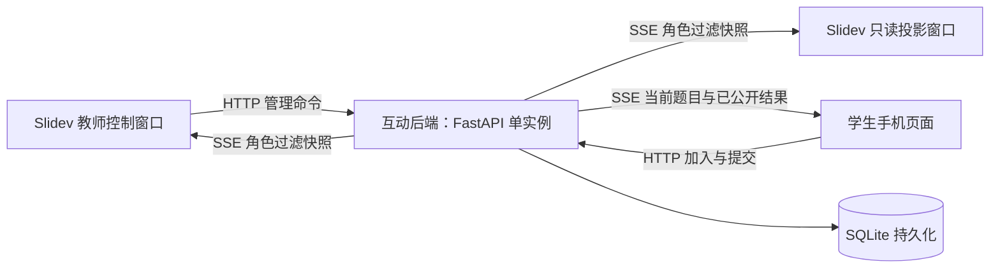

# Slidev 课堂互动系统设计

> 状态：课件端首期集成已实现，默认关闭，已通过单元测试、构建及浏览器模拟验证。互动后端和独立学生页面尚未开发；真实认证、学生投稿、跨窗口服务端同步与容量仍待联调，不能直接作为正式课堂服务上线。实际接入与前端契约见第 15 节。
>
> 容量基线：同时约 1～3 个课堂，每课堂约 100 名学生。首期推荐单体、单实例部署，不引入 Redis、消息队列或微服务。技术选型是本方案的建议，不改变课程教学技术栈。

面向 `classroom-interaction` 开发团队的落地资料：[技术说明与接口契约](classroom-interaction-technical-spec.md)整理实际请求/响应、SSE、角色白名单与学生端建议；[交接说明](classroom-interaction-handover.md)提供资产清单、实施顺序、联调步骤、部署模板和验收清单。本文保留总体设计与决策背景。

## 1. 目标与范围

### 1.1 首期目标

- 保持公开课件正常访问、现有 `pnpm build` 和静态发布流程。
- 只有经过后端认证的教师，才能主动开启、恢复、管理课堂和活动。
- 普通课件浏览不调用互动 API、不建立 SSE、不自动创建课堂；已登录教师也不会因为打开课件而自动连接。
- 教师按需显示二维码；学生扫码进入独立手机页面，一次加入后跟随活动切换。
- 支持选择题和自由文本；课件显示投票统计、获准展示的评论和精选内容。
- 同时支持单窗口授课，以及教师控制窗口与只读投影窗口分离。
- 后端故障、断网或活动结束不影响课件翻页。

### 1.2 首期不做

- 实名学籍、考勤、正式考试、成绩册、复杂题库、跨教师共同管理课堂。
- 学生图片上传、富文本、Markdown 渲染、评论回复、点赞、AI 审核。
- 自动依据翻页开题、跨章节自动迁移会话、多个活动同时接受提交。
- 通用教学门户、iframe 外壳、插件市场、运行时安装 Addon。
- 多副本高可用、分布式消息广播、事件永久回放和复杂统计平台。

匿名参与只能做到浏览器级身份，不能保证“一名真实学生只投一票”；正式考核应另行引入身份系统。

## 2. 总体架构与项目边界



| 部分 | 所属项目 | 职责 |
|---|---|---|
| 课件集成 | 当前 `web-development-slidev` | 全局入口、二维码、教师操作、评论墙、选择题结果、Slidev 适配 |
| 互动服务 | 新建 `classroom-interaction` | 身份、课堂、活动、提交、审核、SSE、持久化 |
| 学生页面 | 新项目的 `web/` | 移动端加入、等待、答题、提交反馈、查看已公开结果 |

新项目内包含后端和学生前端，分别构建，不必再拆成两个仓库。课件不依赖后端源码，只依赖 HTTP/SSE 契约。教师控制面板第一版保留在 Slidev 中，不额外建设教师网站。

推荐生产入口均位于现有 HTTPS 域名下：

| 路径 | 内容 |
|---|---|
| `/web-2026b/ch00/` 等 | 原有静态课件 |
| `/classroom/` | 独立学生页面 |
| `/classroom-api/v1/` | 互动 API 与 SSE |

这是同源反向代理方案，不要求源代码同仓库或服务同进程。课件路由前缀与互动路径相互独立。

## 3. 身份、课堂与活动

### 3.1 权限模型

| 身份 | 获取方式 | 允许操作 |
|---|---|---|
| 公开访客 | 直接打开课件 | 阅读课件、打开登录入口；不能访问课堂数据 |
| 教师 | 账号密码登录 | 创建课堂、管理本人课堂、发布题目、审核和控制投影 |
| 学生 | 使用有效课堂加入码加入 | 读取所在课堂的学生视图、提交自己的答案 |
| 展示端 | 兑换教师生成的一次性配对码 | 读取指定课堂的展示视图，无写权限 |

- 教师账号由运维命令创建或重置，不开放注册；密码保存 Argon2id 哈希。
- 使用服务端登录会话和随机不透明 Cookie，不在课件中存放长期密钥，不采用 URL 教师令牌。
- `teacher_sid`、`student_sid`、`display_sid` 使用不同 Cookie 名，均设置 `HttpOnly`、生产环境 `Secure`、`SameSite=Lax`、`Path=/classroom-api/`，不设置跨子域 Domain。
- 三类 Cookie 分别绑定教师、课堂参与者、课堂展示授权；数据库只存随机凭证的哈希。
- 教师登录有效期默认 12 小时；学生和展示凭证最长 8 小时且不超过课堂过期时间。已结束课堂可在凭证剩余有效期内读取最终只读状态，但不得新加入或提交。
- 同一浏览器同时拥有多个角色 Cookie 时，按明确的接口角色选择凭证。展示接口不能因为存在教师 Cookie 就返回教师数据。
- 所有资源操作验证角色、所属教师或课堂成员关系以及资源之间的关联。知道 `sessionId`、页码或打开 Slidev 演讲者模式都不代表获得权限。
- Cookie 鉴权的写接口采用同源 Origin 校验和 JSON 请求约束，拒绝跨站、缺失/不匹配 Origin 及表单类型请求；包括登录、加入、配对兑换。生产不开放通配 CORS。SSE/GET 只读；有 Origin 时校验白名单，结合 Fetch Metadata 拒绝跨站访问，不因同源 GET 没有 Origin 头而误拒绝。

### 3.2 会话标识

课程名、章节名和时间用于生成可读名称，后端唯一 ID 用于关联数据：

| 字段 | 含义 |
|---|---|
| `sessionId` | 后端生成 UUID，唯一标识一次实际课堂 |
| `courseId` / `courseName` | 稳定课程标识及显示名称 |
| `deckId` / `chapterName` | 稳定章节课件标识及显示名称 |
| `classLabel` | 可选班级标签，不引入班级管理表 |
| `displayName` | 默认“课程名 · 章节名 · 班级（可选） · 开始时间” |
| `startedAt` / `expiresAt` | 后端 UTC 时间，界面按 `Asia/Shanghai` 显示 |
| `joinCode` | 随机 8 位非易混淆字母数字加入码，数据库唯一约束，碰撞重试 |

课件元数据和名称在创建时保存快照，后续修改课件标题不改变历史课堂。加入码只用于学生加入，不是管理凭证；结束或过期立即失效。不能仅用“课程名＋章节名＋浏览器时间”做唯一键。

首期一个课堂绑定一个章节课件；同一章可由不同教师、不同班级分别创建课堂。会话默认最长 8 小时，后台每分钟关闭到期课堂，各 API 也检查到期时间，避免依赖定时任务的执行时刻。

### 3.3 状态与操作语义

- 课堂：`active → ended`；结束不可重新开放，可创建下一次课堂。
- 活动：`draft → open → closed`；已关闭活动不重开，需要重做时复制成新活动。
- 一堂课最多一个 `open` 活动；关闭活动后保留其为当前活动，便于公布结果；开启下一活动时替换当前活动。
- 开启下一题前先关闭当前题；后端拒绝同时开题，而不是悄悄关闭旧题。
- 结束课堂在同一事务内关闭当前活动、停止投稿、使加入码失效并记录结束时间。

| 用户动作 | 课堂是否继续 | 当前窗口 SSE |
|---|---|---|
| 收起本地控制面板 | 继续，投影不变 | 保留 |
| 教师“隐藏投影内容” | 继续，广播展示模式变化 | 保留 |
| “退出互动” | 继续，可稍后恢复 | 关闭并清理本窗口绑定 |
| 关闭浏览器 | 继续，连接自然断开 | 断开 |
| “结束课堂” | 结束，不再接受投稿 | 通知所有连接后关闭 |

## 4. 当前 Slidev 项目内的设计

### 4.1 接入方式

当前工程使用 Vue 3、Slidev 52 系列依赖和根目录章节入口；[构建脚本](../scripts/build-site.mjs)逐章构建，现有 [slide-bottom.vue](../slide-bottom.vue)仅负责校徽。

采用本地 Vue 组件与 Slidev 全局层，不修改 Slidev 源码，不替换主题，不增加 iframe 外壳。当前已实现以下文件：

| 位置 | 职责 |
|---|---|
| `global-top.vue` | 挂载跨页互动浮层，概览/导出等非播放场景隐藏 |
| `custom-nav-controls.vue` | “课堂互动”入口、连接状态提示 |
| `components/classroom/ClassroomHost.vue` | 配置校验、延迟加载与错误提示 |
| `components/classroom/ClassroomRuntime.vue` | 唯一 store 所有者、Teleport、原生 dialog 与清理 |
| `components/classroom/ClassroomOverlay.vue` | 组合二维码、题目、结果、评论墙 |
| `components/classroom/TeacherPanel.vue` | 登录、课堂选择、题目编辑、审核、展示控制 |
| `components/classroom/JoinQrCode.vue` | 本地生成二维码及加入码，不调用第三方二维码服务 |
| `components/classroom/ChoiceResults.vue` | 选项人数和比例，使用普通 CSS 图表即可 |
| `components/classroom/CommentWall.vue` | 最多展示 20 条可见评论，最多 3 条置顶 |
| `composables/useClassroom.ts` | 每个应用实例共享状态及唯一连接管理器 |
| `services/classroom-client.ts` | HTTP、SSE、错误处理和重连 |
| `services/slidev-classroom-adapter.ts` | 读取入口元数据、导航及渲染上下文，隔离 Slidev API |
| `types/classroom.ts` | 当前前端 API 和事件契约，后端开发时据此对齐 OpenAPI |

`global-top.vue` 是应用内全局层；`slide-bottom.vue`、页内组件可能有多实例，不在其中创建网络连接。导航按钮与浮层调用同一份状态，不各自创建订阅。

### 4.2 章节元数据与运行配置

在需要启用的章节入口 headmatter 中增加自定义 `classroom` 对象，仅包含 `courseId`、`courseName`、`deckId`、`chapterName`。例如当前课程使用稳定 `courseId=web-development-2026b`，导论使用 `deckId=ch00`。

- 适配模块从章节入口读取该对象，不依赖当前页标题、不从页码推导课堂身份。
- 缺少元数据时隐藏互动入口，不影响课件构建和阅读；当前教师面板可填写班级标签，显示名称由后端根据元数据、班级与开始时间生成，不能修改标识。
- `title` 仅作为展示名称的辅助信息，不按分隔符拆解：当前 ch00 和 ch01 标题格式本来就不相同。
- 使用公开构建配置 `VITE_CLASSROOM_ENABLED`、`VITE_CLASSROOM_API_BASE`、`VITE_CLASSROOM_STUDENT_BASE`；默认路径为 `/classroom-api/v1`、`/classroom/`。这些值不是秘密。
- 运行时用网站 origin 解析互动绝对路径，不与 Slidev 的 `BASE_URL` 或 `/web-2026b/chXX/` 拼接。
- 章节创建时间、会话 ID、账号、凭证和正确答案均不写入公开课件；题目和答案首期在教师面板输入并保存于后端。

### 4.3 延迟启用与连接状态机

正常打开课件只加载轻量入口，不请求身份接口，不恢复 Cookie 所代表的课堂，更不建立 SSE。点击入口后再动态加载互动组件与客户端模块。

连接状态为 `idle → connecting → connected`，异常进入 `reconnecting`，课堂结束进入 `ended`，退出或授权失效回到 `idle`。身份检查和登录另用 `busy`、`teacher`、`role` 表达，不与连接阶段混用。

1. 教师点击互动入口只加载面板；再点击“教师登录 / 选择课堂”才查询身份，必要时登录。
2. 身份确认后列出本人、当前课件的进行中课堂；只有明确“新建”才发送创建请求。
3. 创建或选择已有课堂成功后，绑定 `sessionId` 并开启教师 SSE。
4. 创建请求带 `Idempotency-Key`；请求超时重试使用原键，不自动再开一个课堂。
5. 只向 `sessionStorage` 保存非敏感的角色、会话标识和操作重试键。刷新后显示“恢复互动”入口，用户确认并重新验证权限后才连接；不因存储项存在而自动订阅。
6. 退出时主动 `close()`、清理计时器与待处理请求；组件反复显示、翻页、热更新均不得增加连接数。

课件普通页面、演讲者下一页预览和概览中的组件不创建独立订阅。导出构建显式关闭互动开关；即使配置开启，未主动激活也不得连网或出现登录浮层。

### 4.4 展示控制和双窗口

课堂保存共享 `displayMode`：`hidden`、`join`、`activity`、`results`，默认 `hidden`。分别代表不遮挡课件、显示加入二维码、显示当前题目、显示当前活动获准公开的结果。进入下一活动时重置为 `activity`，不沿用上一题的答案展示设置。

教师控制面板的展开状态只属于本窗口；`displayMode` 才是影响投影的服务端状态。单窗口授课时同一应用兼具控制与展示，不再开第二条 SSE；投影内容仍使用公开字段，不能把待审核内容自动铺到课件上。

双窗口时：

1. 教师生成有效期 5 分钟、随机 10 位字母数字的一次性展示配对码，区别于学生加入码。
2. 投影窗口打开相同章节，点击“作为展示端连接”，手动输入配对码。
3. 后端原子兑换配对码，设置仅该课堂的 `display_sid`；随后建立展示 SSE。
4. 教师变更投影模式、公开结果或精选评论，后端同步到展示端。
5. 教师可撤销展示授权；凭证过期或被撤销时立即/最迟下一个心跳关闭连接并清空展示数据。

配对码不放入学生二维码、不放入页面 URL、不写日志。Slidev 自身翻页同步和演讲者状态不承担业务数据同步。用 `courseId` 和 `deckId` 一起核对课件身份；若与投影所打开章节不一致，提示打开正确章节，不静默绑定。

### 4.5 交互与兼容性

- 二维码同时显示短码和可复制的学生入口，适配投影阅读距离。
- 浮层只拦截自身点击与输入事件，不吞掉全局翻页；输入框内空格/方向键不触发翻页。
- `Esc` 优先收起本地面板，不直接结束课堂；结束课堂需确认。
- 断网显示“不再实时更新”的状态，保留已获准展示内容并允许一键收起，不伪造提交成功。
- 教师面板提示单窗口操作可能被投影看见；敏感审核使用双窗口。
- 第一版主入口为全局浮层；页内评论墙后续可复用状态，但页内组件不能开启活动或建立连接。

### 4.6 Addon 演进

首期保留本地实现。另一个课程需要复用时，再提取为 `slidev-addon-classroom`，对外提供组件和配置，当前项目保留薄挂载层。各章入口声明 `addons`，主题继续独立使用。

不做浏览器运行时插件加载。更新课件端功能仍需重新构建；调整课堂、题目、评论和后端不需要重新构建课件。

## 5. 独立学生页面

新项目 `web/` 使用 Vue 3 + Vite + TypeScript，不依赖 Slidev，不下载课件资源，不引入复杂 UI 框架。

| 页面 | 行为 |
|---|---|
| `/classroom/` | 手动输入加入码 |
| `/classroom/join/{joinCode}` | 展示加入确认，可填昵称；确认后 POST 加入，不由 GET 自动创建身份 |
| `/classroom/session/{sessionId}` | 等待、当前题目、提交确认、已公开结果、课堂结束 |

- 二维码指向加入页；确认加入后得到 `student_sid`，跳转课堂页并开启一条学生 SSE。
- 同一课堂已有有效 Cookie 时返回原参与者，不因刷新重复计数；首期同一浏览器同一时间参与一堂课堂，换课堂需明确确认。
- 学生页刷新后可依据自己的 Cookie 恢复课堂，区别于公开课件必须显式恢复；凭证失效时重新加入。
- 切题由服务端推送；本地正在编辑的文本按活动 ID 暂存，绝不能误提交到新活动。
- 点击提交后由 HTTP 返回“已保存”；SSE 不代替提交回执。失败时保留输入和重试 ID。
- 昵称可选、最多 20 字，不收集学号或电话；默认投影匿名，不显示参与者标识。
- 手机后台可能断开 SSE，回到前台立即校验身份并重连；结束后显示终态，不无限重试。

## 6. 活动类型与业务规则

### 6.1 共用规则

活动包含 `activityId`、`sessionId`、`type`、`title`、`status`、创建/开启/关闭时间，以及可选的 `sourceSlide`（仅作追踪，非业务主键）。题干最多 500 字，所有内容按纯文本处理。

草稿允许编辑；一旦开启，题干、类型、选项和正确答案锁定。教师面板可以复制旧活动为新草稿，不做独立题库。

首期结果公开由教师明确操作：选择题关闭后才能公开统计或揭晓答案；文本可以在活动进行中审核并公开。收集状态、结果公开状态、投影显示模式彼此独立：隐藏投影不会撤回学生已经看到的结果。

### 6.2 选择题 `choice`

- `selectionMode` 为 `single` 或 `multiple`；2～8 个选项，每项有稳定 ID 和最多 100 字的标签。
- 正确选项列表可为空，表示投票；非空表示课堂测验。正确答案单独存储，只允许教师接口提前读取，不能嵌入公开 Markdown 或学生初始数据。
- 每个活动、每个参与者最多一份有效回答，接受提交期间可以修改；HTTP PUT 保存当前选择，不累计重复票。
- 后端校验选项存在、选项不重复、单选数量为 1、多选至少 1 项且不超过选项数；教师设置的非空正确答案也要符合相同的选项约束。
- 统计按唯一有效回答计算；百分比的分母为已答人数，多选比例之和可能超过 100%；未答人数按已加入人数减已答人数计算，不把断网人数等同于未答人数。
- 教师实时看统计；学生和投影只有在 `resultsPublished=true` 时才能收到统计；`answersRevealed=true` 时才收到正确答案，且要求活动已关闭、统计已公开。
- 零回答时比例为 0，不能出现除零或 `NaN`；不建设排名与成绩单。

### 6.3 自由文本 `text`

- 每条 1～500 字，去除首尾空白后验证；首期每人每活动最多 5 条，不支持修改已提交内容。
- 每次提交携带客户端生成的 `clientSubmissionId`，重复请求返回原记录，不增加条数。
- 新提交为 `pending`，仅作者和所属教师可见；教师设为 `visible` 后才能出现在学生/展示接口。
- 教师可改为 `hidden` 撤下内容，同时取消置顶；公开快照不保留该内容。撤下不能撤回学生已截屏或已知的信息。
- 允许可见评论置顶，最多 3 条；评论墙包含置顶内容及最新可见内容，总计不超过 20 条。
- 教师审核列表分页，每页 50 条；SSE 不携带全部历史评论，避免无限增长。

## 7. 新建后端的最小工程设计

### 7.1 推荐技术栈

| 层次 | 首期选择 | 理由 |
|---|---|---|
| HTTP 服务 | Python 3.12 + FastAPI + Uvicorn | 异步长连接、输入校验、OpenAPI，保持单体 |
| SSE | `sse-starlette` | 心跳、断开处理、发送超时；不自写 SSE 协议解析 |
| 数据访问 | SQLAlchemy 2 异步接口 + aiosqlite | 避免同步数据库调用阻塞事件循环 |
| 数据库 | SQLite，本地持久化卷，WAL 模式 | 约 300 学生、短写事务，无额外数据库服务 |
| 迁移 | Alembic | 管理少量表的后续演进 |
| 身份 | Argon2id + 数据库会话 | 无第三方 SSO、JWT 刷新体系或集中权限平台 |
| 部署 | 一个后端容器、一个 Uvicorn worker，前置现有 nginx | 运行成本和故障面较小 |

依赖版本在新项目落地时锁定。SQLite 是首期容量下的推荐，不是已压测结论；达到第 12 节验收标准后才宣称满足课堂容量。

### 7.2 建议目录

```text
classroom-interaction/
├── backend/
│   ├── app/
│   │   ├── main.py             # 路由、静态学生页面、进程生命周期
│   │   ├── config.py           # 环境配置与限额
│   │   ├── db.py               # 数据库和短事务
│   │   ├── models.py           # 持久化模型
│   │   ├── schemas.py          # 输入与角色专用输出模型
│   │   ├── auth.py             # 会话、权限与来源校验
│   │   ├── api/                # 身份、课堂、活动、提交、展示路由
│   │   ├── services.py         # 状态流转、提交和审核业务
│   │   └── realtime.py         # 单进程订阅表与快照广播
│   ├── migrations/
│   ├── tests/
│   └── pyproject.toml
├── web/                       # 学生端 Vue 工程
├── Dockerfile
└── compose.yaml               # 仅一个服务和持久化数据卷
```

不预先增加通用 Repository 框架、服务发现或任务平台。广播订阅表、合并通知计时器和限流计数放进程内；课堂、身份、活动、提交和展示状态全部入库。

### 7.3 数据表与约束

| 表 | 关键内容与约束 |
|---|---|
| `teachers` | ID、唯一账号、密码哈希、启用状态 |
| `auth_sessions` | 凭证哈希、角色、教师/参与者/课堂关联、过期与撤销时间 |
| `classroom_sessions` | UUID、owner、课件元数据快照、唯一加入码、状态、当前活动 ID、展示模式、`revision`、起止时间 |
| `participants` | ID、课堂 ID、昵称、加入时间；浏览器凭证由 `auth_sessions` 关联 |
| `activities` | ID、课堂 ID、类型、状态、题干、选项配置 JSON、教师专用正确答案 JSON、公开开关和时间 |
| `responses` | ID、活动 ID、参与者 ID、回答类型、选项 JSON 或文本、审核状态、置顶顺序、提交幂等 ID、时间 |
| `display_pairings` | 配对码哈希、课堂 ID、有效期、兑换时间；兑换后关联展示会话 |
| `command_keys` | 教师 ID、命令作用域、幂等键、请求摘要、结果资源 ID、过期时间 |

数据库层必须实现：

- 外键检查开启，回答、活动和参与者必须属于同一课堂，后者由业务事务校验。
- `responses` 对选择题建立 `(activity_id, participant_id)` 条件唯一索引；文本对 `(activity_id, participant_id, client_submission_id)` 建立条件唯一索引。
- `activities` 对 `status=open` 的 `session_id` 建立条件唯一索引，确保每课堂最多一道开放题。
- `command_keys` 对 `(teacher_id, scope, key)` 唯一；同键异请求体返回冲突，记录至少保留 24 小时。
- 常用索引覆盖课堂 owner/status、活动 session/status、提交 activity/created_at、审核 activity/visibility，以及凭证哈希与过期时间。
- 不单独建立课程、班级或统计表；首期统计通过索引查询计算，小规模选项结果可在应用内聚合。

### 7.4 并发与事务

SQLite 配置 `journal_mode=WAL`、`foreign_keys=ON`、`busy_timeout=5000`，使用本地磁盘，不放网络文件系统。

写业务采用短事务；“检查是否开放→保存回答→增加 revision”及“关闭活动”均在受控写事务中完成，必要时使用 `BEGIN IMMEDIATE`，避免先检查后写入的竞争。以数据库事务获得顺序判断是否赶在关闭前提交，不使用浏览器时间。

- 事务内不发送 SSE、不等待网络、不做密码哈希或耗时计算；密码哈希和验证在线程池执行并限制并发，不阻塞 SSE 所在的事件循环。
- 先提交数据库，再通知内存广播；事务失败不能向学生返回成功。
- 全局课堂数、参与人数、投稿条数和置顶数的检查与新增也放在同一个写事务，不能仅由 UI 或事务外查询限制。
- 先验证访问权限，再处理已有幂等结果，最后检查是否允许新写入；已保存文本的同 ID 同内容重试返回原记录，同 ID 不同内容返回 409。关题后相同选择的重试可以返回已存回答，但不能新增或改票。
- 数据库锁等待耗尽返回可重试错误，客户端保留原幂等键；不静默丢弃回答。
- 选择题 PUT 幂等处理网络重试；前端同一题一次只允许一个在途保存，保存结果确定前不发送下一次更改，避免请求乱序覆盖。
- 明确禁止多个 Uvicorn worker 或多个后端副本，否则内存广播无法覆盖其他进程的客户端；只换数据库不能解决这一问题。

## 8. HTTP 接口契约

所有业务接口前缀为 `/classroom-api/v1`；路径中的 `{sid}`、`{aid}`、`{rid}` 分别表示课堂、活动和回答 ID。下表是首期接口边界，实现时由 FastAPI OpenAPI 固化字段类型。

| 方法与路径 | 权限 | 作用 |
|---|---|---|
| `POST /auth/login` | 同源访客 | 教师登录，设置 Cookie，不创建课堂 |
| `GET /auth/me`、`POST /auth/logout` | 教师会话 | 身份检查、退出并撤销该登录会话 |
| `POST /sessions` | 教师 | 创建课堂；课件元数据、可选班级与名称；必带幂等键 |
| `GET /sessions?courseId=...&deckId=...&status=active` | 教师 | 列出本人、当前课程章节的课堂，分页 |
| `POST /sessions/{sid}/end` | owner | 幂等结束课堂 |
| `PATCH /sessions/{sid}/display` | owner | 修改 `displayMode`，校验当前活动与结果状态 |
| `POST /sessions/{sid}/pairings` | owner | 创建一次性配对码 |
| `POST /display/exchange` | 同源访客 | 兑换配对码，设置展示 Cookie |
| `POST /sessions/{sid}/display-revoke` | owner | 撤销该课堂全部展示授权及未兑换配对码 |
| `POST /join` | 同源访客 | 加入码、可选昵称；返回成员身份、课堂 ID，设置学生 Cookie |
| `GET /sessions/{sid}/state?view=teacher\|student\|display` | 对应角色 | 读取角色过滤快照，用于恢复和网络错误判定 |
| `GET /sessions/{sid}/events?view=teacher\|student\|display` | 对应角色 | SSE，不能凭 view 参数提升权限 |
| `POST /sessions/{sid}/activities` | owner | 新建草稿，必带幂等键 |
| `GET /sessions/{sid}/activities` | owner | 分页列出课堂活动和历史结果入口 |
| `PATCH /activities/{aid}` | owner | 修改草稿，开放后拒绝 |
| `POST /activities/{aid}/open`、`POST /activities/{aid}/close` | owner | 幂等开题/关题，验证课堂状态及唯一开放题 |
| `PATCH /activities/{aid}/publication` | owner | 设置统计公开、答案揭晓；只支持从未公开到公开 |
| `GET /activities/{aid}/results` | owner | 读取该活动完整教师统计，供历史查看 |
| `PUT /activities/{aid}/answer` | 所属学生 | 保存当前选择，返回最终已存回答 |
| `POST /activities/{aid}/responses` | 所属学生 | 文本投稿，使用 `clientSubmissionId` 去重 |
| `GET /activities/{aid}/my-responses` | 所属学生 | 恢复自己的已存回答，不公开他人私有提交 |
| `GET /activities/{aid}/responses?visibility=...&cursor=...` | owner | 分页审核列表 |
| `PATCH /responses/{rid}/moderation` | owner | 设为可见/隐藏和置顶，更新公开快照 |

统一约定：

- 时间为 UTC ISO 8601；ID 均为字符串；分页默认 50 条、上限 100 条。
- 创建成功返回 201，重复幂等请求返回原资源；PUT/PATCH 成功返回最新资源。创建重试查询幂等结果优先于重复执行。
- 错误体包含稳定 `code`、可读 `message`、`requestId`；401 未登录、403 无权限、404 不可访问/不存在、409 状态冲突、410 已结束/过期操作、422 校验错误、429 限流、503 暂时不可用。
- 每个响应模型按角色白名单组装，不把 ORM 对象整体序列化后交给前端隐藏。
- 学生公共快照和展示视图不能包含教师信息、配对码、未审核评论、别人身份或未公开正确答案；学生自己的私有回答只通过提交回执及 `my-responses` 返回。教师视图可包含学生加入码以生成二维码，展示视图仅在 `join` 模式下包含加入信息。
- 退出登录不结束课堂，但关闭该登录会话下的教师 SSE；独立学生与展示授权继续到课堂结束、过期或撤销。

## 9. SSE 与状态同步

### 9.1 连接数和事件内容

使用同源原生 `EventSource`，浏览器自动发送对应 HttpOnly Cookie，不需要在查询参数中携带令牌，也不依赖自定义 Authorization 请求头。

正常规模约为 `3 × (100 学生 + 1 教师 + 1 展示端) = 306` 条 SSE。公开访问课件的人数不计入此数量，因为他们不建立连接。每个浏览器应用实例只维持一条当前角色连接。

首期采用“数据库持久化＋最新完整快照”，不做历史事件回放：

| 事件 | 内容 |
|---|---|
| `snapshot` | `schemaVersion=1`、`sessionId`、持久化 `revision`、课堂状态、当前活动、角色可见的展示/结果字段 |
| `session.ended` | 最终角色过滤状态及结束原因；客户端随后关闭连接 |
| `auth.expired` | 授权过期或撤销；清空敏感状态并关闭连接 |
| SSE 注释心跳 | 每 15 秒一次，不作为业务事件，不更新数据库 |

教师快照包含统计与待审核数量，不包含完整审核历史；面板按需刷新分页列表。学生快照是同课堂可复用的公开内容，不携带个人答案；自己的提交从 HTTP 回执及 `my-responses` 获取，首次进入/切题/重连时补取。

### 9.2 广播与数据隔离

- 进程内以课堂 ID 和角色维护订阅；一次数据库提交后标记课堂待更新。
- 投稿引起的统计/数量变化最多每 500 毫秒合并一次；开题、关题、展示控制、审核撤下和结束立即更新。
- 每轮从一致性读事务获取数据，为教师、学生、展示分别生成快照；公开数据不变就不向对应角色发送新快照。
- 同一角色快照复用序列化结果，不为每位学生各查一次数据库，也不把每条投稿扇出成 100 次历史列表查询。
- 每个连接只保留一个待发送的最新快照，新快照覆盖旧快照；不积压无限消息。结束/撤权属于终止控制，优先发送并关闭，不能被普通快照覆盖。
- 慢客户端发送超时后关闭；其他客户端不等待它。SSE 生命周期中不持有数据库事务、连接或写锁。

### 9.3 重连与一致性

- 所有会改变课堂快照的业务写入都在同一事务递增课堂 `revision`，包括加入、投稿、审核、状态和展示控制；心跳与读取不递增。
- 初次连接和每次重连都读取数据库最新快照，不依赖内存事件历史；无需恢复 Last-Event-ID 对应的逐条事件。
- 先注册订阅，再读取初始一致性快照；服务端和客户端按 `revision` 防止旧快照覆盖新快照，首帧无条件接受。公开事件 revision 有跳跃是正常现象。
- 数据库提交成功但进程在广播前崩溃时，重连读库仍能恢复正确状态。服务重启不重新创建课堂。
- 前端在连接异常后关闭旧 EventSource，结合状态接口校验权限与课堂终态；网络问题按 1、2、4、8 秒递增，最长 15 秒并加随机抖动，只保留一个重试定时器。
- 401/403、凭证撤销或课堂结束停止重连；429 尊重重试等待。已结束课堂的事件接口返回 204，状态接口仍可返回授权范围内的最终快照。
- 服务端建立连接时检查授权，存量连接每个心跳周期检查到期/撤销，撤销操作同时主动通知匹配的连接。
- 后台切回前台时重连并补取自己的回答；旧异步请求用连接代次/活动 ID 校验，不能覆盖新课堂或新题状态。

## 10. 部署、容量与运行约束

### 10.1 单实例部署

推荐复用现有 nginx，新增互动后端单容器；容器内学生前端构建产物由 FastAPI 静态路由提供，业务进程只运行一个 Uvicorn worker。SQLite 文件放容器外持久化卷。

- nginx 将 `/classroom-api/`、`/classroom/` 代理到该容器；应用保留完整路径，不在多处重复添加/移除前缀。
- 学生 SPA fallback 仅作用于 `/classroom/`；API 错误不能被回退成 HTML，也不能进入章节 fallback。
- SSE 路径关闭代理缓冲和缓存、关闭该路径压缩，使用流式转发；上游 HTTP/1.1，读取超时至少 75 秒，确保 15 秒心跳穿透；应用发送 `text/event-stream`、`Cache-Control: no-store` 与 `X-Accel-Buffering: no`。
- TLS 在 nginx 终止，外部全站 HTTPS；静态资源可缓存，身份与课堂 API 不缓存。
- 后端仅暴露给反向代理，SQLite 不对外提供端口；限制可信代理，避免伪造转发 IP 绕过限流。
- 配置文件描述公开 origin、API/学生路径、数据库位置、课堂限额与超时；凭据与运行数据不提交到 Git。
- 课件继续使用现有构建脚本，不合并学生构建到 `pnpm build`；部署互动更新不要求重新发布课件。

以 2 vCPU、2 GB 内存作为首轮压测起点，不作为未经测试的容量保证。长连接主要等待 I/O，不按 306 连接配置 306 个进程或线程。配置文件描述符和代理连接额度时预留上下游连接及普通 HTTP 请求空间，建议起步不少于 4096 个文件描述符。

现有 Netlify/Vercel 静态部署能力不变，但其配置不会自动提供互动后端。首期生产按上述自有 nginx 同源部署；若改用其他站点，需要单独验证长连接代理、Cookie 与跨域，不假设普通 Serverless 函数适合永久 SSE。

### 10.2 初始限额

| 项目 | 初始值与规则 |
|---|---|
| 同时 active 课堂 | 默认上限 3，可配置；创建超限提示，不抢占已有课堂 |
| 每课堂参与人数 | 上限 150，为约 100 人留余量；按参与者去重，不按连接计数 |
| 全局 SSE | 上限 600；每个授权会话最多 2 条，应对偶发多窗口 |
| 学生写操作 | 每参与者每 10 秒最多 5 次，允许短时突发 |
| 文本投稿 | 每人每活动最多 5 条；每课堂每活动最多 750 条 |
| 请求体 | 最大 16 KB；超限尽早拒绝 |
| 登录防爆破 | 按账号和来源分别限速，例如账号每分钟 5 次失败后短暂冷却 |
| 加入与配对 | 按来源和码值限速；为校园共享 NAT 留余量，加入每来源每分钟可允许 600 次；配对失败采用更严格阈值 |

限流计数和连接配额先放内存，接受进程重启后计数重置；身份、参与人数、幂等记录不依赖这些内存计数。公开部署需结合实际校园出口调整阈值，不能用“每 IP 两条 SSE”误伤整班学生。

### 10.3 运维与恢复

- `health/live` 检查进程，`health/ready` 执行轻量数据库探测；健康接口不给出内部路径或凭证。
- 记录请求 ID、状态码、耗时、匿名内部资源 ID、SSE 数和数据库锁等待；不记录密码、Cookie、配对码、完整加入 URL、学生评论或答案正文。
- 学生页面设置 `Referrer-Policy: no-referrer`，不接第三方统计；nginx 对加入路径做日志脱敏或关闭该路径访问日志。
- 每天使用 SQLite 在线备份接口生成一致性备份，保留 7 天，至少做一次恢复演练；不能只复制活跃数据库主文件而遗漏 WAL。
- 数据默认保留 90 天，定时清理已结束课堂及关联数据；备份另有最多 7 天的残留窗口，向使用者说明。
- 迁移先备份再执行，发布安排在课间；单实例更新可能短暂断线，客户端重连恢复。首期不承诺无停机与故障自动切换。
- 定时任务由同一进程启动，包括过期课堂关闭和清理；启动时先补处理已过期课堂。

### 10.4 本地联调

开发时分别启动 Slidev、学生 Vite 和后端。两个前端开发服务器都将 `/classroom-api/` 代理到后端；Slidev 开发服务器另将 `/classroom/` 代理到学生 Vite，扫码地址采用手机可访问的局域网 origin，不能使用 `localhost`。

只在开发配置白名单中允许对应 origin，并在本地 HTTP 下关闭 Cookie 的 Secure 标记；生产始终启用 HTTPS 和 Secure。开发代理已写入根目录 `vite.config.mjs`，目标通过启动环境变量配置（见第 15 节）；代理不进入静态构建产物，不能代替生产 nginx 配置。

## 11. 安全与降级清单

- 所有学生内容只用文本节点展示，不使用 `v-html`；正文字数由后端最终裁决。
- 教师专属内容、未公开正确答案、他人的未审核文本不得出现在学生接口中；展示接口只返回获准公开内容，不能仅在 DOM 中隐藏。学生读取自己尚待审核的提交不受此限制。
- 加入码不是强实名认证；泄露后外部人员可能加入。首期通过有效期、人数限制、限流和结束课堂控制风险，不宣称防作弊。
- 配对兑换在事务中一次性消费，错误提示不泄露已存在课堂；随机码碰撞需重试。
- 对跨课堂访问、参与者伪造、直接修改活动 ID 和 view 参数均做后端校验。
- 后端不可用时可继续浏览课件；学生提交失败保留输入，不在本地队列中跨活动自动重放。
- 除了读取静态资源，公开浏览零互动网络请求；相关验收必须在已有登录 Cookie、无 Cookie、刷新恢复等情况下分别进行。

## 12. 测试与验收

本节是完整系统的验收要求，不代表全部完成。当前课件端已完成的检查和仍未验证的边界见第 15.5 节。

### 12.1 功能与权限

- 教师登录、创建/恢复课堂、超时重试只创建一次；同课件同时创建不同班级互不影响。
- 未登录、学生、展示端均不能管理课堂；教师 A 不能管理教师 B 的课堂。
- 扫码加入、重复加入、昵称校验、课堂满员、结束码失效和配对码单次兑换。
- 单选/多选验证、重复 PUT 不增票、修改答案后统计正确、关题竞争时结果一致。
- 文本重复 POST 不增条、数量限制、审核可见、隐藏即撤下、置顶数量限制。
- 从网络响应检查未公开正确答案及待审核文本不存在，而不仅仅观察页面未显示。
- 显示模式与学生结果公开状态相互独立；同一浏览器不同角色接口不串权限。

### 12.2 Slidev 与端到端

- 普通访问、已有教师 Cookie 访问、翻页、概览、演讲者预览、PDF 导出均不自动创建课堂或连接。
- 主动进入后每应用实例一条 SSE；开关浮层及翻页不增加连接；退出与结束正确关闭。
- 教师和投影两个窗口同步开题、结果与评论；学生二维码不包含配对或教师凭证。
- 在 `ch00` 和 `ch01` 不同 base 下验证元数据、API、二维码地址，不误拼接章节路径。
- 按需启用后构建产物仍为静态站点；后端断网时课件继续可用。
- 手机 Safari/Chrome 及课堂常用扫码内置浏览器验证 Cookie、SSE、后台恢复；发现不兼容时提示用系统浏览器打开，并说明跨浏览器 Cookie 不共享、可能需要重新加入。

### 12.3 容量与故障

1. 运行 3 个课堂，每课堂 100 学生、1 教师、1 展示端，维持至少 60 分钟，观察内存、连接和数据库锁等待。
2. 三堂课共 300 位学生在 5 秒内提交一次，重复多轮；选择题、文本和修改答案分别测试。
3. 验收目标：稳定条件下提交 API p95 不超过 1 秒，集中提交 p95 不超过 3 秒；需公开的变更到展示端 p95 不超过 2 秒。报告同时注明服务器配置和网络条件。
4. 核对提交成功回执数与数据库记录、去重后的统计一致，无跨课堂混入、持续锁错误或无界队列增长。
5. 模拟服务重启、网络断开、慢消费者、权限撤销、关题瞬间提交以及所有客户端重连；课堂身份和答案不丢失，不产生重复会话。
6. 用 500 次普通课件访问叠加上述负载，验证后端不会因此增加身份请求或 SSE。

若未达到目标，先检查同步阻塞、事务长度、重复订阅、未合并广播和代理缓冲；不要先增加 worker。只有确认数据库写竞争为持续瓶颈才迁移 PostgreSQL；需要多进程/多副本时再引入跨进程发布订阅与共享限流，单独设计该阶段。

## 13. 实施顺序与交付物

| 阶段 | 交付物 | 完成标准 |
|---|---|---|
| A：后端纵向链路 | 新项目、数据表、教师登录、课堂、加入、文本提交、SSE、最简学生页 | 独立于 Slidev 完成一堂课的收集、审核与结束 |
| B：当前项目接入 | 全局入口、元数据适配、二维码、教师面板、评论墙、显式恢复 | 公开页面零自动连接；静态构建部署后可现场互动 |
| C：完整首期功能 | 选择题、公开结果、一次性投影配对、双窗口、限流与重连 | 两类活动及角色隔离全部验收 |
| D：上线验证 | 同源代理、持久化卷、备份恢复、容量与故障报告 | 满足 3×100 场景测试；明确单实例维护窗口 |

阶段 A～C 都通过后才作为正式课堂工具，阶段 D 完成后上线。目前先完成阶段 B 及 C 的课件侧开发，以模拟接口验证；阶段 A 和服务端验收尚未开展。课件正文和原有逐章构建脚本未改动，仅在章节 headmatter 添加公开课程标识。

## 14. 参考与现有工程依据

- [项目说明与部署约定](../README.md)
- [当前构建脚本](../scripts/build-site.mjs)
- [导论入口](../ch00.md)、[第 1 章入口](../ch01.md)
- [Slidev 全局层](https://sli.dev/features/global-layers)
- [Slidev 全局上下文](https://sli.dev/guide/global-context)
- [Slidev Addon 编写](https://sli.dev/guide/write-addon)

## 15. 当前课件端落地与联调契约

### 15.1 启用和构建

`VITE_CLASSROOM_ENABLED` 默认关闭。启用是构建时选择，不代表自动连接，也不能代替教师认证：

```bash
pnpm install --frozen-lockfile
pnpm test
pnpm typecheck
VITE_CLASSROOM_ENABLED=true pnpm dev
VITE_CLASSROOM_ENABLED=true pnpm build
# 常规课件构建和导出可显式关闭
VITE_CLASSROOM_ENABLED=false pnpm build
VITE_CLASSROOM_ENABLED=false pnpm export
```

也可把公开的 `VITE_` 配置放在不提交的 `.env.local` 中；修改后重启开发服务器或重新构建。`pnpm typecheck` 仅检查本次集成的 Vue、服务、类型和测试，不对全部教学 Markdown 做类型检查。

| 配置 | 默认值 | 含义 |
|---|---|---|
| `VITE_CLASSROOM_ENABLED` | 非 `true` 即关闭 | 隐藏入口且不加载运行时 |
| `VITE_CLASSROOM_API_BASE` | `/classroom-api/v1` | 同源 API 根路径 |
| `VITE_CLASSROOM_STUDENT_BASE` | `/classroom` | 同源学生页根路径 |
| `CLASSROOM_API_PROXY` | 不代理 | 开发命令环境变量，后端 origin |
| `CLASSROOM_STUDENT_PROXY` | 不代理 | 开发命令环境变量，学生 Vite origin |

API/学生地址仅接受同源 HTTP(S)，不接受查询参数、账号密码或 fragment。配置无效时阻止初始化并显示错误，不能把教师登录信息发送到其他 origin。默认开发代理匹配 `/classroom-api/`、`/classroom/`；修改公开路径时须同步修改代理匹配项。

### 15.2 本地与生产接入

后端和学生项目准备好后，在当前项目启动：

```bash
VITE_CLASSROOM_ENABLED=true \
CLASSROOM_API_PROXY=http://127.0.0.1:8000 \
CLASSROOM_STUDENT_PROXY=http://127.0.0.1:5173 \
pnpm exec slidev ch00.md --port 3030
```

代理目标变量从启动进程环境读取，不从 `.env.local` 自动加载。代理保留路径和浏览器 Origin；后端须允许实际前端 origin，学生 Vite 配置 `base: '/classroom/'`。手机联调要开放开发服务器局域网访问并从局域网 origin 打开课件，否则二维码中的 `localhost` 无法供手机使用。课堂后端没有部署时，点击身份操作出现 404 或非 JSON 提示属于预期，不能据此把静态服务器当作后端。

生产仍单独发布课件静态产物、学生构建和后端，再配置第 10 节的同源反向代理、Cookie、SSE 缓冲和超时。现有 Netlify/Vercel 配置没有自动添加互动代理。

### 15.3 操作与生命周期

- 播放页/演讲者页底部导航提供“互动”；概览、导出、缺少元数据的课件不提供入口。已有 Cookie 或恢复记录也不会自动调用互动 API。
- 进入教师身份后列出当前章节课堂，可创建、选择或显式恢复；学生加入码和展示配对码分开。未创建真实后端时没有可用教师账号。
- 单选、多选、投票和文本先保存草稿，再明确开题。选择题关闭后可公开统计、揭晓答案；审核按活动分页，列表显式刷新，数量通过 SSE 更新。
- 面板使用浏览器原生模态 dialog，Esc 收起且保留连接；收起会丢弃面板内尚未保存的输入，请先保存草稿。密码不写入浏览器存储。
- “仅在本窗口收起”保留到教师切题/切换展示模式或用户主动返回展示；同题 revision 和人数变化不会使它重新弹开。
- 路由离开允许的播放场景、pagehide、卸载/HMR 时关闭连接；返回或刷新需主动恢复。已连接窗口从后台回前台时先重新校验 state。
- sessionStorage 仅存课件身份、sessionId、角色及课堂创建重试键/班级标签；活动题目、答案、评论及配对码只留内存。退出互动清除绑定，退出教师登录还调用后端撤销当前教师 Cookie。
- 原生 EventSource 由一个管理器托管；断线关闭旧实例，HTTP 校验后指数退避，最大 15 秒，429 另尊重 Retry-After。401/403/404/410 和协议不兼容停止重试并清理敏感状态。

### 15.4 已固定的前端接口形状

[types/classroom.ts](../types/classroom.ts) 是当前前端的字段依据；后端开发时需要据此生成角色专用响应与 OpenAPI，不能把下表视为已经存在的后端。所有 JSON 使用 camelCase，不包裹额外 `data` 字段。逐项接口说明、完整快照示例与 FastAPI 兼容注意事项见[技术说明](classroom-interaction-technical-spec.md)。

| 请求 | 当前前端发送 | 当前前端读取 |
|---|---|---|
| `POST /auth/login` | `{username,password}` | `{teacherId,displayName}` 和 Set-Cookie |
| `GET /auth/me` | 无 body | 同上；未登录 401 |
| `POST /auth/logout` | `{}` | 204 或 JSON 成功体 |
| `POST /sessions` | `{courseId,courseName,deckId,chapterName,classLabel}`，`Idempotency-Key` | `ClassroomSession` |
| `GET /sessions` | `courseId,deckId,status=active,cursor?` | `{items: ClassroomSession[],nextCursor: string\|null}` |
| `POST /display/exchange` | `{code}`（转大写） | `{sessionId}` 和展示 Set-Cookie |
| `GET /sessions/{sid}/state` | `view=teacher\|display` | 下方完整快照 |
| `PATCH /sessions/{sid}/display` | `{displayMode}` | JSON/204，然后前端补取 state |
| `POST /sessions/{sid}/pairings` | `{}` | `{code,expiresAt}` |
| `POST /sessions/{sid}/end`、`display-revoke` | `{}` | JSON/204；结束后补取最终 state |
| `GET /sessions/{sid}/activities` | `cursor?` | `{items: ClassroomActivity[],nextCursor: string\|null}` |
| `POST /sessions/{sid}/activities`、`PATCH /activities/{aid}` | `ActivityDraft`；仅 POST 带幂等键 | JSON/204；随后刷新列表 |
| `POST /activities/{aid}/open`、`close` | `{}` | JSON/204；随后刷新 state 和列表 |
| `PATCH /activities/{aid}/publication` | `{resultsPublished:true}` 或 `{answersRevealed:true}` | JSON/204；随后刷新 state 和列表 |
| `GET /activities/{aid}/responses` | `visibility,cursor?` | `{items: ClassroomComment[],nextCursor: string\|null}` |
| `PATCH /responses/{rid}/moderation` | `{visibility:'visible'\|'hidden',pinned:boolean}` | 更新后的 `ClassroomComment` |

快照顶层必填 `schemaVersion:1`、`revision`（非负整数）、`sessionId`、`session`、`displayMode`、`currentActivity`、`results`、`comments`。无活动/统计分别使用 `null`，无评论使用 `[]`，不能省略。`participantCount`、`pendingCount` 为可选非负整数，仅教师视图按权限返回。

- `session` 必填 `sessionId`、四个课件元数据、`displayName`、`status`、`startedAt`、`expiresAt`；`classLabel` 和 `joinCode` 可选。展示加入码仅在 `join` 模式返回。
- `ActivityDraft` 必填 `type:'choice'|'text'`、`title`，可选 `sourceSlide`。choice 另含 `selectionMode:'single'|'multiple'`、`options:[{id,label}]`、`correctOptionIds:string[]`（空表示投票）。
- `ClassroomActivity` 在草稿字段上增加 `activityId`、`sessionId`、`status`、`resultsPublished`、`answersRevealed`；未揭晓的正确答案字段不得进入学生/展示视图。
- 统计为 `{respondentCount,counts:{[optionId]:人数}}`；公共视图未公开时必须返回 `results:null`。多选按回答人数作分母。
- 评论为 `{responseId,activityId,text,visibility,pinned,createdAt}`。公共 comments 仅可见评论，最多 20 条；审核私有历史从分页接口读取。
- SSE `snapshot` 和 `session.ended` 的 data 都是同一完整快照 JSON；`auth.expired` 的 data 不参与业务读取，事件名本身触发清理。首次订阅必须尽快发快照（客户端首帧等待 15 秒），不能只发心跳。
- 所有读取/写入均要求后端最终鉴权；前端展示过滤只是第二道保护。未实现历史活动统计查看 UI，第 8 节 `/activities/{aid}/results` 暂未被当前课件端调用。

### 15.5 已完成验证与剩余边界

当前验证结果：

- `pnpm install --frozen-lockfile`、`pnpm test`（47 项）、`pnpm typecheck` 通过。
- 关闭和开启互动两种整站构建均通过，覆盖 ch00/ch01 不同 base；运行时与二维码库为单独懒加载 chunk。
- 浏览器普通播放、翻页、概览、演讲者和导出路由均未自动发互动 API；导出页属性警告修正后复验为零。只检查导出路由，没有生成完整 PDF/PPTX。
- 两章生产静态产物的身份请求均从 `/classroom-api/v1` 发出，面板元数据正确；无后端时 404 提示清晰。
- 临时浏览器模拟验证：创建/编辑/开关两类题、公开统计与答案、评论审核/精选/隐藏、二维码、单 SSE、同题本地收起、退出清理、结束二次确认和旧事件隔离。输入框键盘与 Esc 在首轮检查通过；后续因自动化视图不可见，补充流程使用 DOM 事件验证，不能等同于全浏览器键盘兼容验收。
- 测试覆盖旧 revision、取消/迟到响应、跨课件拒绝、幂等创建、分页、429、401/403/404/410、HTML fallback、未公开结果隔离。恶意 HTML 字符串上墙时仅显示文本，无注入元素或脚本执行。

尚未验证：真实教师认证与角色响应过滤、学生扫码投稿、一次性配对原子兑换、真实双窗口 SSE、生产 nginx、手机 Safari/内置浏览器、PDF 实际导出、3×100 容量与故障恢复。模拟服务没有打包进生产代码，也未提供可用于真实授课的假登录。
