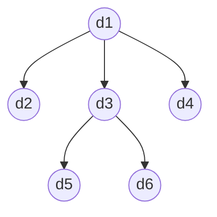
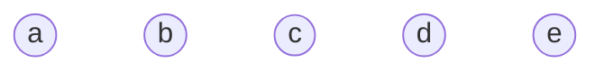
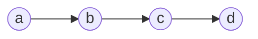
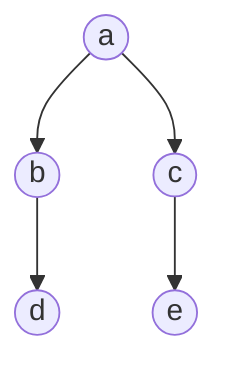
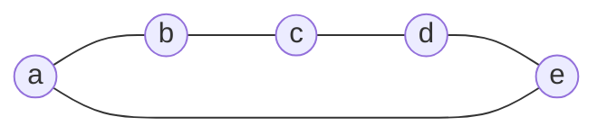

# 第 1 次课
## 数据结构的基本概念与 ADT 实现（含 C 回顾与引用语义）

<!--
本次课目标（学生下课时应该能做到五件事）：
① 说出数据 / 数据对象 / 数据元素 / 数据项的层次，并在一张学生成绩表上指认；
② 拿到任一名词（二叉树、邻接矩阵、队列、单链表……）能判断它属于逻辑结构还是存储结构；
③ 说出 ADT 三要素，解释伪代码 InitComplex(&C, v1, v2) 里那个 & 是什么；
④ 说出引用与指针的三条差别，并为一个给定接口选对形参形式（值 / 指针 / 引用 / 常量引用）；
⑤ 照模板写出规范的 malloc 四步，认出六类内存错误。

本课重点：逻辑结构 vs 存储结构；ADT 与信息隐藏；引用形参与指针形参的等价与差异；动态内存规范。
本课难点：引用的绑定语义（必须初始化、不可改绑、无空引用）与生命周期（不可返回局部对象的引用）；next 为什么只能是指针。
-->

---

# 在 10 亿个号码里查一个号

<div class="pt-5 space-y-7 text-sm">

<div v-click="1" class="flex items-center gap-5">

<div class="w-48 shrink-0">
  <div class="font-bold">无序 + 顺序查找</div>
  <div class="text-xs opacity-60 pt-0.5">从头逐个比，平均翻到一半</div>
</div>

<div class="relative flex-1 h-14 rounded-md border border-gray-400/30 overflow-hidden" style="background-image:repeating-linear-gradient(90deg, rgba(128,128,128,0.25) 0 1px, transparent 1px 24px)">
  <div class="absolute inset-y-0 left-0 bg-orange-400/45" style="width:50%"></div>
  <div class="absolute top-1/2 left-1/2 -translate-x-1/2 -translate-y-1/2 w-2.5 h-2.5 rounded-full bg-red-500/90"></div>
</div>

<div class="w-24 shrink-0 text-right">
  <b class="text-xl text-orange-500">5×10⁸</b><span class="text-xs opacity-60"> 次</span>
</div>

</div>

<div v-click="2" class="flex items-center gap-5">

<div class="w-48 shrink-0">
  <div class="font-bold">有序 + 二分查找</div>
  <div class="text-xs opacity-60 pt-0.5">排好序后，每比一次砍掉一半</div>
</div>

<div class="relative flex-1 h-14 rounded-md border border-gray-400/30 overflow-hidden" style="background-image:repeating-linear-gradient(90deg, rgba(128,128,128,0.25) 0 1px, transparent 1px 24px)">
  <div class="absolute inset-x-1.5 inset-y-1 flex flex-col justify-center gap-1">
    <div class="h-1.5 rounded-full bg-teal-500/30" style="width:100%"></div>
    <div class="h-1.5 rounded-full bg-teal-500/40" style="width:50%"></div>
    <div class="h-1.5 rounded-full bg-teal-500/50" style="width:25%"></div>
    <div class="h-1.5 rounded-full bg-teal-500/65" style="width:12.5%"></div>
    <div class="h-1.5 rounded-full bg-teal-600/80" style="width:6%"></div>
  </div>
</div>

<div class="w-24 shrink-0 text-right">
  <b class="text-xl text-teal-600 dark:text-teal-400">30</b><span class="text-xs opacity-60"> 次</span>
</div>

</div>

<div v-click="3" class="flex items-center gap-5">

<div class="w-48 shrink-0">
  <div class="font-bold">哈希表</div>
  <div class="text-xs opacity-60 pt-0.5">函数直接算出位置（第 9 章细讲）</div>
</div>

<div class="relative flex-1 h-14 rounded-md border border-gray-400/30 overflow-hidden" style="background-image:repeating-linear-gradient(90deg, rgba(128,128,128,0.25) 0 1px, transparent 1px 24px)">
  <div class="absolute inset-y-1.5 bg-teal-500/30 border-x-2 border-teal-600/60" style="left:68%; width:24px"></div>
  <div class="absolute top-1/2 -translate-y-1/2 w-2.5 h-2.5 rounded-full bg-red-500/90" style="left:calc(68% + 11px)"></div>
</div>

<div class="w-24 shrink-0 text-right">
  约 <b class="text-xl text-teal-600 dark:text-teal-400">1</b><span class="text-xs opacity-60"> 次</span>
</div>

</div>

</div>

<div v-click="4" class="pt-12 text-center text-lg">

同一份数据、同一台机器、同一种语言 —— 差 <span class="text-teal-600 dark:text-teal-400 font-bold">10⁸ 倍</span>，只来自一件事：<b>数据怎么组织</b>。

</div>

<!--
上课。先不讲定义，先做一件事。假设我给你一份全国的电话号码，十亿条，我说：帮我查一下 138 开头那个号在不在里面。你打算怎么查？
（等一下）最老实的办法，从头挨着比。平均要比多少次？五亿次——你看这条格子带，橙色的是已经翻过的，平均翻到一半才碰上。
现在我把这十亿个号码先排好序，你用二分查找。猜猜多少次？
（让他们猜，一般会有人说"几千次"、"几万次"）三十次。三十。你看这排越来越短的横杠：每比一次，候选只剩一半，砍三十刀就只剩一个。因为 2 的 30 次方就已经十亿了。
再换一种组织方式——哈希表。你把号码报出来，函数直接算出它该在哪一格，基本一次就拿到。什么是哈希表，第 9 章细讲；你现在只要记住这个感觉：它不是"找"到的，是"算"到的。
数据一模一样，机器一模一样，代码都是你写的，差了一亿倍。差别在哪？不在算力，不在语言，在于数据是怎么摆的。
这就是这门课全部的价值。这门课前八章讲怎么摆数据，后面讲怎么处理数据。今天这节课，是给整门课打地基。
-->

---

# 这个等式，是一本书的名字

<div grid="~ cols-[1fr_1.5fr] gap-6" class="pt-2">

<div class="flex flex-col items-center justify-center">


<div class="pt-2 text-center">
  <div class="text-lg font-bold">Niklaus Emil Wirth</div>
  <div class="text-sm opacity-70 pt-0.5">瑞士计算机科学家</div>
  <div class="pt-1">
    <span class="px-3 py-0.5 rounded-full bg-teal-500/15 text-teal-700 dark:text-teal-300 text-xs font-bold">1984 年图灵奖</span>
  </div>
</div>

</div>

<div class="flex items-center gap-5">


<div class="flex-1 space-y-3 text-sm">

<div class="rounded-lg border p-3">
  <div class="text-xs opacity-60">1976 · 首版</div>
  <div class="font-bold pt-1">《算法 + 数据结构 = 程序》</div>
  <div class="text-xs opacity-70 italic pt-1">Algorithms + Data Structures = Programs</div>
</div>

<div class="rounded-lg border p-3">
  <div class="text-xs opacity-60">1986 · 2004 · 两次大幅修订</div>
  <div class="font-bold pt-1">更名《算法与数据结构》</div>
  <div class="text-xs opacity-70 italic pt-1">Algorithms and Data Structures</div>
</div>

</div>

</div>

</div>

<div grid="~ cols-2 gap-4" class="pt-4">

<div class="rounded-lg border px-4 py-2 text-center">
  <div class="font-bold text-teal-600 dark:text-teal-400">数据结构</div>
  <div class="text-sm opacity-80 pt-0.5">数据在计算机中如何有效地组织起来</div>
</div>

<div class="rounded-lg border px-4 py-2 text-center">
  <div class="font-bold text-teal-600 dark:text-teal-400">算法</div>
  <div class="text-sm opacity-80 pt-0.5">数据如何经过运算解决问题</div>
</div>

</div>

<!--
这门课为什么要两条腿走路？几十年前就有人把这层关系写成了一个等式，而且直接当成了书名。
这个人叫 Niklaus Wirth，瑞士计算机科学家，1984 年图灵奖得主——计算机界的最高奖。
1976 年他写了这本书，书名就是这个等式：《Algorithms + Data Structures = Programs》，算法加数据结构等于程序。他没有把它当口号喊，而是用一整本书去论证它。
这本书获得了广泛认可，1986 年、2004 年两次大幅修订，新书名简化成《Algorithms and Data Structures》——算法与数据结构。
所以你回头看开头那三种查法：同一份数据，摆法不同，快慢差一亿倍。这门课的两条腿——数据结构，管数据在计算机里怎么有效地组织起来；算法，管数据怎么经过运算解决问题。摆得好，算得快。
-->

---

# 整个学期的骨架，就是这张表

| <span class="text-teal-600 dark:text-teal-400 font-bold">逻辑结构</span> | <span class="text-teal-600 dark:text-teal-400 font-bold">顺序存储</span> | <span class="text-teal-600 dark:text-teal-400 font-bold">链式存储</span> |
| -------- | -------- | -------- |
| <span class="text-teal-600 dark:text-teal-400 font-bold">线性表</span> | 顺序表（第 2 章） | 单 / 双 / 循环链表（第 2 章） |
| <span class="text-teal-600 dark:text-teal-400 font-bold">栈、队列</span> | 顺序栈、循环队列（第 3–4 章） | 链栈、链队（第 3–4 章） |
| <span class="text-teal-600 dark:text-teal-400 font-bold">树 / 二叉树</span> | 顺序二叉树、堆（第 6 章） | 二叉链表（第 6 章） |
| <span class="text-teal-600 dark:text-teal-400 font-bold">图</span> | 邻接矩阵（第 7 章） | 邻接表（第 7 章） |

<div v-click class="pt-6">

本章的任务：把这张表的**行标题**（逻辑结构）和**列标题**（顺序存储、链式存储）讲清楚。

</div>

<!--
这张表你先拍照，整个学期我们会回来看它十几次。
你看它的样子：竖着是行标题，线性表、栈队列、树、图，这一列叫逻辑结构；横着是列标题，顺序存储、链式存储。中间每一个格子，都是后面的某一章、某一节。
所以这门课的骨架就是一句话：几种逻辑结构，各自配上几种存储方式，再看在这个组合下每种操作要花多少代价。
今天我不讲任何一个格子。今天我讲行标题和列标题——什么是逻辑结构，什么是存储结构。把这两个词分清楚，这张表你自己就能填。
-->

---

# 开写之前，先把规矩说清楚

<div class="pt-1 space-y-3">

<div class="rounded-lg border px-4 py-2">

**① 编译**：统一用 `g++ -std=c++17 -Wall -Wextra`，源文件用 `.cpp`

</div>
<div class="rounded-lg border px-4 py-2">

**② 语言子集** = C 语言核心 + **三样 C++ 特性**：引用形参、常量引用形参、返回引用

</div>
<div class="rounded-lg border px-4 py-2">

**③ 动态内存**用 `malloc` / `free`，**不用** `new` / `delete`（为什么？1.7 回答）

</div>
<div class="rounded-lg border px-4 py-2">

**④ 标准库容器**（`vector`、`list`、`map`……）只作对照阅读，**不用于实现**——我们要造的正是它们

</div>
<div class="rounded-lg border px-4 py-2">

**⑤ IDE**：推荐 **CLion**（学生可免费申请授权）+ **Qoder** 或其它同类AI Coding插件

</div>
</div>

<!--
在写第一行代码之前，先把规矩说清楚，免得后面每节课都有人问。
环境不用纠结：IDE 推荐 CLion，学生用学校邮箱就可以免费申请授权；AI Coding 插件用 Qoder 或其它同类都行——写代码时有 AI 帮你补全和查错。
我们用 g++ 编译，文件后缀 .cpp。但注意，我们写的不是"完整的 C++"。我们写的是 C 语言，只额外借三样东西：引用形参、常量引用形参、返回引用。就三样，为什么借，这节课后半段你就知道了。
内存分配我们用 malloc 和 free，不用 new 和 delete。为什么？留个悬念，一会儿讲动态内存的时候我专门回答。
还有一条：STL 那些容器，vector、list、map，你们可以看，可以对照，但不许用来实现作业。原因很简单——这门课就是在造 vector 和 list。你直接调用它，等于考试时抄答案，抄完你还是不会。
（这页快讲，不逐条展开——它的功能是"以后不许再争"，先让学生拍照。）
-->

---

# 四个基本概念，一张成绩表就讲明白

<div grid="~ cols-2 gap-8" class="pt-1">
<div class="text-sm">

| 概念 | 定义 |
| ---- | ---- |
| 数据 （Data）| 能被计算机处理的符号总称 |
| 数据对象 （Data Object）| **性质相同**的数据元素的集合 |
| 数据元素 （Data Element）| 数据的基本单位，一个数据元素可由若干个**数据项**组成 |
| 数据项 （Data Item）| 组成元素的最小不可分单位 |

<div class="pt-3">

**层次关系**：数据 ⊃ 数据对象 ⊃ 数据元素 ⊃ 数据项

</div>
</div>
<div>

<div class="rounded-lg border-2 border-dashed border-teal-500/70 p-3">
  <div class="text-xs text-teal-600 dark:text-teal-400 pb-2">整张表 = 数据对象</div>
  <table class="w-full text-xs text-center">
    <thead class="opacity-60">
      <tr><th class="py-1">学号</th><th>姓名</th><th>性别</th><th>成绩</th></tr>
    </thead>
    <tbody>
      <tr class="bg-orange-500/15">
        <td class="py-1">20230101</td><td>张三</td><td>男</td>
        <td><span class="rounded border border-teal-500 px-1.5">92</span></td>
      </tr>
      <tr><td class="py-1">20230102</td><td>李四</td><td>女</td><td>88</td></tr>
      <tr><td class="py-1">20230103</td><td>王五</td><td>男</td><td>76</td></tr>
      <tr><td class="py-1">20230104</td><td>赵六</td><td>女</td><td>91</td></tr>
      <tr><td class="py-1">20230105</td><td>钱七</td><td>男</td><td>85</td></tr>
    </tbody>
  </table>
  <div class="flex justify-between pt-2 text-xs">
    <span class="text-orange-500">高亮一行 = 一个数据元素（一条记录）</span>
    <span class="text-teal-600 dark:text-teal-400">框住一格 = 一个数据项</span>
  </div>
</div>

</div>
</div>

<!--
四个基本概念：数据、数据对象、数据元素、数据项。听起来像绕口令，但看一张表就明白了。
看这张成绩表。整张表，六十个学生，性质相同的一堆记录，这叫数据对象。
拿出其中一行，张三，学号，性别，成绩——这一行我们通常整体地处理，比如"把张三这条记录插进去"、"把张三删掉"，不会说"把张三的性别插进去"。所以一行是一个基本单位，叫数据元素。
再往里，一行里的每一格，学号、姓名、成绩，这叫数据项。
问一句：score 是数据元素还是数据项？（停）对，数据项。
这张表的三个标注要停一下，让学生用手指指："哪一行是数据元素，哪一格是数据项。"
让学生用"班级花名册""图书馆藏书目录"再举一组例子，检查术语是否真的分清了。
-->

---

# 这些名字，后面会一直换

| 术语 | 又称 |
| ---- | ---- |
| 数据元素 | **结点** node（链表、树）· **顶点** vertex（图）· **记录** record（数据库、文件） |
| 数据项 | **字段** field · **域** |

<div grid="~ cols-2 gap-8" class="pt-12">
<div>

**"最小不可分"是相对应用而言的**

`姓名` 在学籍系统里不可分；国际化系统里要拆成 `姓`/`名` 两项。

</div>
<div class="text-sm">

```c
typedef struct {
    char  id[13];    /* 数据项 */
    char  name[21];  /* 数据项 */
    char  sex;       /* 数据项 */
    float score;     /* 数据项 */
} Student;           /* Student 变量 = 一个数据元素 */
Student cls[60];     /* 数据对象 */
```

<div class="pt-2 text-xs opacity-70">

你在 C 课里写过的东西，在这门课里都有了名字。

</div>
</div>
</div>

<!--
顺便打个招呼：这个"数据元素"，换个结构就换个名字——链表、树里叫结点，图里叫顶点，到了数据库、文件里叫记录。别以为是新东西，还是那个概念，只是叫法变了。数据项也一样，以后你会听到字段、域，都是它。
最后一句要注意：数据项说是"最小不可分"，可它不是绝对的。姓名，在我们学籍系统里就是一格，不可分。可你要做一个国际化的系统，姓和名的排列顺序不一样，你就得拆成两项。谁决定拆不拆？应用需求决定。这句话你现在觉得是废话，等你自己设计结构的时候会想起来。
落到代码上就很自然了：一个 struct 就是一个数据元素，struct 里的成员就是数据项，struct 数组就是数据对象。
-->

---

# 数据结构的广义定义

<div class="pt-6 text-center text-2xl">

数据结构 ＝ <span class="text-teal-600 dark:text-teal-400">逻辑结构</span> ＋ <span class="text-orange-500">存储结构</span> ＋ <span class="opacity-80">运算</span>

</div>

<div class="pt-4 text-center opacity-80">

其中，**逻辑结构** $= (D, S)$ —— $D$ 是数据元素的有限集，$S$ 是 $D$ 上关系的有限集。

</div>

<div v-click class="pt-4">

<div grid="~ cols-[1.3fr_1fr] gap-6" class="items-center">

<div class="text-sm">

设有数据结构 $B = (D, S)$：

- $D = \{d_1, d_2, d_3, d_4, d_5, d_6\}$
- $S = \{\langle d_1,d_2\rangle, \langle d_1,d_3\rangle, \langle d_1,d_4\rangle, \langle d_3,d_5\rangle, \langle d_3,d_6\rangle\}$

</div>

<div class="text-center">



<div class="text-xs -mt-2 opacity-70">逻辑结构图</div>

</div>

</div>

</div>

<div v-click class="pt-5 text-center">

**逻辑结构是抽象的** —— 与存储无关、与机器无关、与语言无关

<div class="pt-2 text-lg">

它只回答两件事：**有哪些元素**，它们之间**是什么关系**。

</div>
</div>

<!--
现在给这门课下定义。注意，这是广义的定义：三样都算。数据结构等于什么？逻辑结构、存储结构、运算。有的教材说得窄，只把逻辑结构叫数据结构，那是狭义的说法。
先说逻辑结构。逻辑结构只管两件事：有哪些元素、它们之间是什么关系。数学上写成 D 和 S 一对集合：D 是元素，S 是元素之间的关系。注意，这对集合只是三样里的第一样，存储结构和运算，后面分别细讲。
来，看一个具体的例子。设有数据结构 B = (D, S)：D 里是六个元素，d1 到 d6；S 里是五组关系——d1 分别连到 d2、d3、d4，d3 又连到 d5、d6。你拿笔按这五组关系画一下，就是右边这张图：一棵树，d1 在顶上，d2、d3、d4 在第二层，d5、d6 挂在 d3 下面。
你看，这一路下来，没提内存，也没提用什么语言。它只回答两件事：有哪些元素、它们之间是什么关系——与存储无关、与机器无关、与语言无关。这就是逻辑结构。
-->

---

# 数据元素之间的关系，一共就四种

<div grid="~ cols-2 gap-6" class="pt-1">
<div class="text-sm">

| 逻辑结构 | 关系 | 生活实例 |
| -------- | ---- | -------- |
| 集合 | 同属一个集合 | 关键字去重 |
| 线性结构 | 一对一 | 排队、通讯录 |
| 树形结构 | 一对多 | 文件目录、族谱 |
| 图形结构 | 多对多 | 路网、社交关系 |

<div class="pt-3 text-xs opacity-80">

线性结构的严格描述（第 2 章埋线）：有且仅有一个开始结点、一个终端结点；除开始结点外每个结点有唯一前驱；除终端结点外每个结点有唯一后继。

</div>
</div>
<div grid="~ cols-2 gap-2" class="items-center">

<div v-click class="text-center">


<div class="text-xs -mt-2">集合 · 无关系</div>
</div>

<div v-click class="text-center">


<div class="text-xs -mt-2">线性 · 一对一</div>
</div>

<div v-click class="text-center">


<div class="text-xs -mt-2">树形 · 一对多</div>
</div>

<div v-click class="text-center">


<div class="text-xs -mt-2">图形 · 多对多</div>
</div>

</div>
</div>

<div v-click class="pt-3 text-xs opacity-70">

另一种常见二分法：**线性结构 vs 非线性结构（树、图、集合）**。

</div>

<!--
关系一共能有几种花样？其实就四种。
第一种，最松的：除了"我们都在这个集合里"，元素之间什么关系都没有。这叫集合。就像一袋子豆子，你说不出哪颗在哪颗前面。
第二种，一对一：每个元素最多一个前面的、一个后面的，串成一条线。排队、通讯录、一行文本，都是这个。这是我们第二到第四章的全部内容。
第三种，一对多：一个爸爸可以有好几个孩子，但每个孩子只有一个爸爸。文件目录就是这样，C 盘下面很多文件夹，但每个文件夹只在一个上级里。这叫树。
第四种，多对多：谁跟谁都能连。地图上的路网，社交关系。这叫图。
四张图一张一张给，每给一张就问一个生活实例。
最后补一句，线性结构的严格定义我念一遍，你们第二章会天天用到：有且仅有一个开始结点，有且仅有一个终端结点，除了开头，每个结点有唯一前驱；除了末尾，每个结点有唯一后继。"有且仅有一个"、"唯一"，这些词都不是废话，第二章讲循环链表的时候你会回来抠这几个字。
-->

---

# 三个场景，判断属于哪种关系

<div class="pt-10 grid grid-cols-3 gap-6 text-center">

<div class="rounded-xl border p-6">
  <div class="text-xl">微信好友关系</div>
  <div v-click class="pt-4 text-teal-600 dark:text-teal-400">图 —— 好友是互相的、任意的</div>
</div>

<div class="rounded-xl border p-6">
  <div class="text-xl">Ctrl+Z 撤销历史</div>
  <div v-click class="pt-4 text-teal-600 dark:text-teal-400">线性 —— 只能一端进出，那是栈（第 3 章）</div>
</div>

<div class="rounded-xl border p-6">
  <div class="text-xl">家族族谱</div>
  <div v-click class="pt-4 text-teal-600 dark:text-teal-400">树 —— 一对多</div>
</div>

</div>

<!--
（图给完之后）来，考你们三个。微信好友关系，是哪种？举手。……对，图，因为好友是互相的、任意的。Ctrl+Z 的撤销历史？线性，而且是很特殊的线性，只能从一头进出，那叫栈，第三章讲。族谱？树。
举手表决，不要我自己念答案。
-->

---

# 同一个逻辑结构，两种内存映像

<div class="pt-1 text-center text-sm opacity-80">

同一个逻辑结构：$a_1 \to a_2 \to a_3 \to a_4$

**存储结构**，也叫**物理结构** —— 抽象的逻辑关系在内存中的表示

</div>

<div grid="~ cols-2 gap-6" class="pt-4">
<div>

<div class="text-center">
  <div class="pb-3 text-sm font-bold text-teal-600 dark:text-teal-400">顺序存储 · 地址连续</div>
  <div class="flex justify-center">
    <div class="w-14 h-12 border border-teal-500 flex items-center justify-center bg-teal-500/10">a₁</div>
    <div class="w-14 h-12 border border-teal-500 border-l-0 flex items-center justify-center bg-teal-500/10">a₂</div>
    <div class="w-14 h-12 border border-teal-500 border-l-0 flex items-center justify-center bg-teal-500/10">a₃</div>
    <div class="w-14 h-12 border border-teal-500 border-l-0 flex items-center justify-center bg-teal-500/10">a₄</div>
  </div>
  <div class="flex justify-center font-mono text-xs text-teal-600/80">
    <div class="w-14 text-center">100</div>
    <div class="w-14 text-center">104</div>
    <div class="w-14 text-center">108</div>
    <div class="w-14 text-center">112</div>
  </div>
  <div class="pt-3 text-xs opacity-80">地址相邻 ⇒ 逻辑相邻（关系被位置隐含）</div>
  <div class="pt-1 font-mono text-xs">LOC(aᵢ) = LOC(a₁) + (i−1) × sizeof(elem)</div>
</div>

</div>
<div>

<div class="text-center">
  <div class="pb-3 text-sm font-bold text-orange-500">链式存储 · 结点散布</div>
  <div class="flex items-end justify-center gap-1 font-mono">
    <div class="flex flex-col items-center">
      <div class="flex border border-orange-500 rounded overflow-hidden bg-orange-500/10">
        <div class="w-9 h-11 flex items-center justify-center border-r border-orange-500/50">a₁</div>
        <div class="w-12 h-11 flex items-center justify-center text-xs">800</div>
      </div>
      <div class="pt-1 text-xs opacity-70">@100</div>
    </div>
    <div class="pb-5 text-orange-500">→</div>
    <div class="flex flex-col items-center">
      <div class="flex border border-orange-500 rounded overflow-hidden bg-orange-500/10">
        <div class="w-9 h-11 flex items-center justify-center border-r border-orange-500/50">a₂</div>
        <div class="w-12 h-11 flex items-center justify-center text-xs">302</div>
      </div>
      <div class="pt-1 text-xs opacity-70">@800</div>
    </div>
    <div class="pb-5 text-orange-500">→</div>
    <div class="flex flex-col items-center">
      <div class="flex border border-orange-500 rounded overflow-hidden bg-orange-500/10">
        <div class="w-9 h-11 flex items-center justify-center border-r border-orange-500/50">a₃</div>
        <div class="w-12 h-11 flex items-center justify-center text-xs">912</div>
      </div>
      <div class="pt-1 text-xs opacity-70">@302</div>
    </div>
    <div class="pb-5 text-orange-500">→</div>
    <div class="flex flex-col items-center">
      <div class="flex border border-orange-500 rounded overflow-hidden bg-orange-500/10">
        <div class="w-9 h-11 flex items-center justify-center border-r border-orange-500/50">a₄</div>
        <div class="w-12 h-11 flex items-center justify-center text-xs opacity-60">NULL</div>
      </div>
      <div class="pt-1 text-xs opacity-70">@912</div>
    </div>
  </div>
  <div class="pt-3 text-xs opacity-80">每个结点 = [ 数据 | 指针 ]；地址不连续，关系靠指针显式记录</div>
  <div class="pt-1 text-xs opacity-80">最后一个指针为 NULL —— 表示"没有下一个"</div>
</div>

</div>
</div>

<div v-click class="pt-5 text-center">

它们是**同一个逻辑结构**，却是两种不同的**存储结构**。

</div>

<!--
逻辑结构讲完了，它是抽象的。可计算机内存是实的，一格一格的字节。所以必须回答第二个问题：这个抽象的关系，在内存里怎么落地？这就是存储结构，也叫物理结构。
存储结构要表示两样东西。第一样好办：元素本身，一个 struct 存进去就完了。难的是第二样：关系怎么存？"a1 在 a2 前面"这句话，内存里怎么写下来？
只有两种办法。
第一种办法：我把它们摆在挨着的地方。a1 在 100 号地址，a2 就在 104，a3 在 108。谁在谁前面？看地址就知道了。关系没有被显式地存下来，它是被位置隐含着的。这叫顺序存储，载体就是数组。
第二种办法：我不管它们摆在哪儿，可能 a1 在 100 号，a2 在 800 号，a3 在 302 号，乱七八糟。但我在 a1 里额外留一个格子，写上"下一个在 800"。关系被显式地存下来了，存在指针里。这叫链式存储。
（指两幅图）来，看这两幅图。你们告诉我，它们是不是同一个数据结构？
（等）它们是同一个逻辑结构，都是线性表 a1 到 a4，逻辑上都是一条链。但它们是两种不同的存储结构。
这一页我会同时在左板画图并保留整节课，后面讲 next、讲 malloc 都要回指它。两幅图必须并排同屏对峙。
-->

---

# 顺序 vs 链式：一张表看清全部差别

<div class="pt-1 text-sm">

| 维度 | 顺序存储 | 链式存储 |
| ---- | ---- | ---- |
| <span class="text-orange-500 font-bold">关系如何表示</span> | 靠**物理位置相邻**隐含表示 | 靠**指针**显式表示 |
| 逻辑相邻 ⇒ 物理相邻？ | 是 | 不要求 |
| 典型载体 | 数组 | 带指针域的结点 |
| <span class="text-orange-500 font-bold">随机访问</span> | **O(1)**，一次乘法加法算出地址 | 不支持，需从头遍历 O(n) |
| 插入 / 删除 | 需移动元素，平均 O(n) | 改指针即可 O(1)（已定位） |
| 空间 | 需预分配，可能浪费或溢出 | 按需分配，但每结点多耗指针空间 |
| 缓存友好性 | 好（连续） | 差（跳转）→ 下次课再谈 |

</div>

<div class="pt-4 text-sm opacity-80">

另外两种存储方法：**索引存储**、**散列存储**——后续查找章节展开。

</div>

<!--
这个差别的后果非常大，我只讲两条，其他你自己看表——只需重点讲"关系如何表示"和"随机访问"这两行，其余行让学生自己扫。
第一条，顺序存储支持随机访问：我要第 1000 个元素，一个乘法一个加法直接算出地址，O(1)。链式不行，你只能从头一个个跳过去，O(n)。
第二条反过来，插入删除，顺序存储要挪一大堆元素，链式只要改两个指针。
还有一行叫缓存友好性，我先不讲，下次课讲复杂度的时候会拿实测数据打你们的脸——你会发现理论上一样快的两个东西，实际能差好几倍。
最后点个名，除了这两种，教材还提索引存储和散列存储，那是查找那一章的事，今天不管。
-->

---

# 三句常听到的话，每一句都不对

<div class="pt-2 space-y-3 text-sm">

<div class="rounded-lg border p-3">
  <div class="text-base">"<span class="text-red-500">✗</span> 链表是一种逻辑结构。" —— 对吗？</div>
  <div v-click class="pt-1 text-teal-600 dark:text-teal-400">✓ 错。链表是<b>链式存储的线性表</b>——"链"这个字说的是存储方式。</div>
</div>

<div class="rounded-lg border p-3">
  <div class="text-base">"<span class="text-red-500">✗</span> 栈是顺序存储的。" —— 对吗？</div>
  <div v-click class="pt-1 text-teal-600 dark:text-teal-400">✓ 错。栈是<b>逻辑结构</b>（受限线性表）——既可以顺序存储（顺序栈），也可以链式存储（链栈），第 3 章两种都写。</div>
</div>

<div class="rounded-lg border p-3">
  <div class="text-base">"<span class="text-red-500">✗</span> 二叉树只能用链表实现。" —— 对吗？</div>
  <div v-click class="pt-1 text-teal-600 dark:text-teal-400">✓ 错。完全二叉树用数组实现更省——那就是后续章节要学习的<b>堆</b>。</div>
</div>

</div>

<!--
接下来三句话，你们判断对不对。每条先问"这句话对不对"，等学生表态，再揭示纠正。
第一句："链表是一种逻辑结构。"对吗？（等）错。链表是链式存储的线性表，"链"这个字说的是存储方式。
第二句："栈是顺序存储的。"（等）错。栈是逻辑结构，是一种受限的线性表，只允许一端进出。它既可以顺序存储——那叫顺序栈；也可以链式存储——那叫链栈。第三章两种都写一遍。
第三句："二叉树只能用链表实现。"错，第六章见。
-->

---

# 数据类型 = 值集合 + 操作集合

<div grid="~ cols-2 gap-8" class="pt-2">
<div>

先看一个你已经熟了的东西：C 里的 `int`

- 一个<b class="text-teal-600 dark:text-teal-400">取值范围</b>（32 位机上 −2³¹ ~ 2³¹−1）
- 一组<b class="text-teal-600 dark:text-teal-400">允许的运算</b>（`+ - * / %`、比较……）

<div class="pt-3 opacity-80">

你不能对 `int` 做取子串——它的操作集合里没这一项。

</div>
</div>
<div v-click>

<b class="text-teal-600 dark:text-teal-400">抽象数据类型 ADT</b>：一个数学模型，及定义在该模型上的一组操作。

$$ ADT = ({\color{#0d9488}D, S}, P) $$

<span class="text-teal-600 dark:text-teal-400">$D$ 数据对象、$S$ 数据关系</span>、$P$ 基本操作。

<div class="pt-2">

核心：只规定"<b class="text-teal-600 dark:text-teal-400">能做什么</b>"，不规定"<b class="text-orange-500">怎么实现</b>"——"抽象"抽掉的正是实现。

</div>

<div class="pt-2">

**ADT 也叫做数据结构的定义**——$D, S$ 就是<b class="text-teal-600 dark:text-teal-400">逻辑结构</b>，$P$ 就是运算的定义。

</div>
</div>
</div>

<!--
ADT 三个字母听着挺玄，其实你早就用过了。
C 里的 int，是什么？（等）它是两样东西的打包：一个取值范围，加一组允许的运算。你不能对 int 做取子串，因为 int 的操作集合里没这一项。所以：数据类型等于值集合加操作集合。
现在把这个想法往上抬一层。我不说 int 了，我说"复数"、"栈"、"队列"——这些东西也有值集合，也有操作集合，只不过语言没给你，得你自己造。当我只描述"值集合长什么样、有哪些操作"，而故意不说它在内存里怎么摆时，这份描述就叫抽象数据类型。
抽象抽掉了什么？抽掉了实现。ADT 只回答"能做什么"，绝不回答"怎么做"。这一点是今天后半节课的全部动机。
再补一句，接回今天的主线：抽象数据类型也叫做数据结构的定义——D、S 是逻辑结构，P 是运算，就差一个存储结构。以后课本每讲一个数据结构，先给的往往就是它的 ADT。
-->

---

# 复数 ADT：一份不涉及内存的规格说明

<div grid="~ cols-2 gap-6" class="pt-1">
<div>

```c
ADT Complex {
    数据对象：两个实数 e1、e2
              （e1 作实部，e2 作虚部）
    数据关系：有序对 <e1, e2>
              两个分量次序不可交换
    基本操作：
        InitComplex(&C, v1, v2)  构造复数
        GetReal(C)               取实部
        GetImag(C)               取虚部
        Add(c1, c2)              两复数相加
        Multiply(c1, c2)         两复数相乘
        Equal(c1, c2)            判等
} ADT Complex
```

</div>
<div>

<div v-click>

这份规格说明里**没有一个字**提到内存——没有数组、没有指针、没有 `malloc`。

<div class="pt-4 text-sm">

<div class="rounded-lg border p-2.5"><code>InitComplex(&amp;C, v1, v2)</code> 里的那个 <code>&amp;</code>——<b>不是取地址</b>，是"把对象本身交给操作"的记法；先记下，后面讲引用形参时展开。</div>

</div>

</div>

<div v-click="+1" class="pt-4">

<div class="rounded-lg border border-teal-500/60 bg-teal-500/10 p-2.5"><b>信息隐藏</b>：使用者只需要知道"能加能乘"，不需要知道内部是直角坐标还是极坐标——实现可以整体替换。</div>

</div>

</div>
</div>

<!--
我们拿复数当第一个例子。为什么不用栈？两个原因说给你们听：复数的数学模型你们高数里已经滚瓜烂熟了，我不用花时间解释"什么是复数相加"，你们的注意力可以百分之百放在"接口长什么样"上；栈要到第三章才讲，现在借来用，等于欠账。
（念一遍 ADT）看这份说明书：数据对象是两个实数，数据关系是有序对——注意"有序"，实部虚部不能换位置；然后是六个操作。
这份东西里有没有一个字提到内存？有没有提数组、指针、malloc？没有。这就叫规格说明：只说能做什么。
操作表里有个符号先带一眼：InitComplex 的括号里，C 前面有个 &。先说半句——它不是取地址运算符；为什么、怎么用，后面讲引用形参的时候整页展开，现在不用管它。
最后体会这份"说明书"对使用者的意义：信息隐藏。用这个复数库的人，只需要会调 Add、Multiply，不需要知道你内部是直角坐标还是极坐标；哪天你把内部整个换掉，他也不用知道。接口把实现挡在外面——这就是为什么先写 ADT、再写代码。
-->

---
layout: section
---

# C 回顾与引用语义

<div class="pt-4 text-sm opacity-60">
为后面每一章打地基——不背结论，到调试器里看内存
</div>

<!--
先把这半节定个性：这是一节地基课。后面每一章——链表、栈、树——代码脚下踩的都是这三样：指针、内存、引用。地基不牢，后面每一章都会晃。
指针这块，我不打算只念四条结论。你们在 C 课都学过指针，但大多数人是"会用"而不是"看过"——变量住哪、指针里装的是什么，脑子里没有画面。我准备了一个小演示程序，这一节我们会把它在调试器里跑一遍，打开 Memory 窗口一字节一字节地看：变量的地址、指针的值、*p 改内存的时候字节怎么变。
看完内存再讲引用——它是后面所有接口形参的主线；最后收在动态内存规范和工程习惯上。这一节走完，后面每一章的代码就读得懂、写得出。
-->

---

# 演示程序 · 两个变量，一根指针

<div class="pt-2">

<<< @/snippets/ch01/memory-insight.cpp#vars

<<< @/snippets/ch01/memory-insight.cpp#ptr

</div>

<!--
这是演示程序的关键代码——完整程序六步，在页面上先盯两处。
第一处：两个 int，值故意选得有特征——0x11223344、0x55667788，就是为了在内存窗口里一眼认出哪个字节属于 a、哪个属于 b；往下几行 printf，把值和地址一起打出来。
第二处：一句 int *p = &a——指针的定义；跟着 printf 把 p 和 &a 并排打出来比较。就这两处。接下来两张调试器截图，就围着这一页的代码看。
-->

---

# 证据一 · 内存里是字节

<div class="pt-3">


<div class="pt-3 text-sm opacity-85">

**Memory View**：在 `&b` 处看 8 个字节——`88 77 66 55` 是 `b`、`44 33 22 11` 是 `a`（小端序，低位字节在前）。

</div>

</div>

<!--
先看第一个证据——变量到底是什么？别急着背结论，到内存里看。
调试器里，我在 Memory 窗口输入 &b，也就是 b 的地址，它把那一段内存摊成一格一格的字节：88 77 66 55 是 b，紧挨着的 44 33 22 11 是 a，两个 int 背靠背，一个占 4 格。注意字节是倒着放的，低位在前——这就叫小端序。
内存不是比喻，变量的值就是一行看得见的字节。
-->

---

# 证据二 · 指针里是地址

<div class="pt-3">


<div class="pt-3 text-sm opacity-85">

**Console**：`&a`、`&b` 相差正好 4 字节；`p` 的值和 `&a` 一模一样。

</div>

</div>

<!--
再看第二个证据：指针里装的是什么？
这是 Console 的输出：第 1 步打出 &a 和 &b——就是刚才内存页摊开的那两个位置，两个地址正好差 4 字节，一个 int 的宽度；第 2 步，p 的值和 &a 一模一样。指针里装的是不是地址？不用背了，值就在屏幕上。
（编辑器里 p = &a 那一行，CLion 已经把 p 的值标在旁边——就是 &a 的那个地址。）
变量有地址、指针存地址、内存是字节——三句话都有了实物，下一页把它们收成结论。
-->

---

# 指针，只留四条结论

<div class="pt-2 text-sm opacity-80">变量有地址、指针存地址、内存是字节——三句话都有实物，收成四条结论。</div>

<div grid="~ cols-2 gap-4" class="pt-5 text-sm">
<div class="rounded-lg border p-3">
  <div class="font-bold">① 指针变量里存的是<b class="text-orange-500">地址</b></div>
  <div class="pt-1.5 opacity-80">证据二里 <code>p == &amp;a</code>——p 的值就是 a 的地址，屏幕上刚见过。</div>
</div>
<div class="rounded-lg border p-3">
  <div class="font-bold">② <code>*p</code> <b class="text-orange-500">解引用</b>；<code>p-&gt;x</code> 等价于 <code>(*p).x</code></div>
  <div class="pt-1.5 opacity-80">顺着地址找过去，拿到的是对象本身；<code>-&gt;</code> 只是"先找对象、再取成员"的简写。</div>
</div>
<div class="rounded-lg border p-3">
  <div class="font-bold">③ <code>NULL</code> 表示"不指向任何对象"</div>
  <div class="pt-1.5 opacity-80">链式结构表示"没有下一个"的<b class="text-orange-500">唯一</b>手段——以后所有遍历都靠它收尾。</div>
</div>
<div class="rounded-lg border p-3">
  <div class="font-bold">④ 指针本身的大小与平台相关，<b class="text-orange-500">与所指类型无关</b></div>
  <div class="pt-1.5 opacity-80">32 位机 4 字节、64 位机 8 字节——<code>int*</code> 和 <code>char*</code> 一样大，年年有人答错。</div>
</div>
</div>

<div class="pt-6 rounded-lg border border-teal-500/50 bg-teal-500/10 p-3 text-sm">

**链式实现完全依赖指针**——指针不熟，第 2 章之后寸步难行。

</div>

<!--
先给指针这部分定个调：是复习，不是新课。我不重讲 C 语言，只挑这门课天天要用的东西扫一遍——哪条你陌生，课后自己补。
指针，收成四条。
第一条：指针里存的是地址——证据二里 p 的值和 &a 一模一样，屏幕上刚看过，不用背。
第二条：星号是解引用——顺着地址找过去，拿到的是对象本身；p->x 只是"先找对象、再取成员"的简写，第二章的代码里满眼都是它。
第三条：NULL 表示不指向任何东西。这一条以后特别重要——链表的末尾靠什么表示"到头了"？就靠 NULL，它是唯一手段；以后所有遍历都靠它收尾。
第四条：指针本身多大？跟它指向什么类型没关系，64 位机上一律 8 字节——年年有人答错。
一句话定调：这门课的链式实现，完完全全靠指针。指针不熟，第二章往后你就寸步难行。这不是吓你，这是事实。
下一页把这条调子落在代码上——这门课最重要的一个 struct。
-->

---

# 自引用结构体——后面所有链式结构的模板

<div class="pt-2 text-sm opacity-80">一个结构体把数据打包成整体；里面有一个指针——指向自己这种类型。</div>

<div grid="~ cols-2 gap-6" class="pt-6 text-sm">
<div>

```c
typedef struct Node {
    int          data;   /* 数据域：对应"数据元素 / 数据项" */
    struct Node *next;   /* 指针域：对应"逻辑关系的显式表示" */
} Node;
```

</div>
<div>

<div class="text-center">
  <div class="pb-3 text-sm font-bold text-orange-500">三个结点 · 串成一条链</div>
  <div class="flex items-end justify-center gap-1 font-mono">
    <div class="flex flex-col items-center">
      <div class="flex border border-orange-500 rounded overflow-hidden bg-orange-500/10">
        <div class="w-9 h-11 flex items-center justify-center border-r border-orange-500/50">10</div>
        <div class="w-12 h-11 flex items-center justify-center text-xs">800</div>
      </div>
      <div class="pt-1 text-xs opacity-70">@100</div>
    </div>
    <div class="pb-5 text-orange-500">→</div>
    <div class="flex flex-col items-center">
      <div class="flex border border-orange-500 rounded overflow-hidden bg-orange-500/10">
        <div class="w-9 h-11 flex items-center justify-center border-r border-orange-500/50">20</div>
        <div class="w-12 h-11 flex items-center justify-center text-xs">302</div>
      </div>
      <div class="pt-1 text-xs opacity-70">@800</div>
    </div>
    <div class="pb-5 text-orange-500">→</div>
    <div class="flex flex-col items-center">
      <div class="flex border border-orange-500 rounded overflow-hidden bg-orange-500/10">
        <div class="w-9 h-11 flex items-center justify-center border-r border-orange-500/50">30</div>
        <div class="w-12 h-11 flex items-center justify-center text-xs opacity-60">NULL</div>
      </div>
      <div class="pt-1 text-xs opacity-70">@302</div>
    </div>
  </div>
  <div class="pt-5 text-xs opacity-80">每个结点都是一个 <code>Node</code>：<code>data</code> 装数据元素，<code>next</code> 存下一个结点的地址</div>
  <div class="pt-1 text-xs opacity-80">最后一个 <code>next</code> 为 <code>NULL</code>——"没有下一个"</div>
</div>

</div>
</div>

<div class="pt-7 rounded-lg border border-orange-500/50 bg-orange-500/10 p-3 text-xs">

坑：里面必须写 `struct Node *next`，**不能写 `Node *next`**——typedef 起的名字要等花括号闭合、分号打完才生效。

</div>

<!--
把调子落在代码上——这门课最重要的一个 struct，看清楚：结构体里有一个指向自己这种类型的指针。
data 是数据域，对应上半节课说的数据元素；next 是指针域，对应什么？（指左板那张"存储结构"图）对应"关系的显式表示"。上半节课那句抽象的话，落在这一行代码上——关系，第一次有了显式的存放处。
（指右图）三个结点串成一条链，每个都是一个 Node：data 里装值，next 里装下一个结点的地址；最后一个 next 写 NULL，链就到头了。以后这样的图，你要画几百遍。
（板书：跟着这张图，在左板"存储结构"那条链旁边再串一遍三个结点——两边互相呼应。）
一个坑，注释里也写了：里面必须写 struct Node *next，不能写 Node *next。为什么？typedef 起的那个名字 Node，要等花括号结束、分号打完才生效，写在里面编译器不认。这个错每年都有人犯。
-->

---

# 七个问题，能全答上来才算过关

<div class="pt-3 flex items-start justify-center gap-4">
<div>

```c
int a = 10;
int *p = &a;   /* p 指向 a */
```

</div>
<div>

```c
typedef struct Node {
    int          data;
    struct Node *next;
} Node;
```

</div>
</div>

<div grid="~ cols-2 gap-4" class="pt-4 text-sm">
<div class="rounded-lg border p-3"><b>①</b>　<code>p</code> 里面存的是什么？</div>
<div class="rounded-lg border p-3"><b>②</b>　要让 <code>a</code> 变成 20：写 <code>p = 20</code> 还是 <code>*p = 20</code>？</div>
<div class="rounded-lg border p-3"><b>③</b>　<code>&amp;p</code> 和 <code>p</code> 有什么区别？</div>
<div class="rounded-lg border p-3"><b>④</b>　<code>Node *p</code>：<code>p->data</code> 展开就是什么？</div>
<div class="rounded-lg border p-3"><b>⑤</b>　<code>Node *p</code> 与 <code>Node p</code> 差在哪？</div>
<div class="rounded-lg border p-3"><b>⑥</b>　数组名和指针是同一回事吗？</div>
<div class="rounded-lg border p-3"><b>⑦</b>　<code>p + 1</code> 跳过几个字节——由什么决定？</div>
<div class="rounded-lg border border-teal-500/50 bg-teal-500/10 p-3">七问全对＝指针基础过关；有任何一问答不出，课后先补 C——第 2 章不等。</div>
</div>

<!--
这一页拍照带走，作业里会检查。
开头两段是背景代码：左边 a 与 p（①②③⑦ 都从它出发），右边是 Node 的定义（④⑤ 用它，与上一页同一模板）。
七个问题，每一个都是第二章以后天天要用的东西：p 里存的是地址，*p 才是对象本身；想让 a 变成 20，要写 *p = 20——改的是 a 的格子，p 自己不动；&p 是"p 这个变量自己的地址"，别跟 p 的值搞混；p->data 就是 (*p).data 的简写；Node *p 是指针、Node p 是实体；数组名在大多数场合退化为指针，但它不是指针——不能自增、sizeof 结果不同；指针加 1 不是"地址加 1"：跳几个字节由它指向的类型决定（int* 跳 4、char* 跳 1）——对照一下，指针的大小与类型无关，指针的步长与类型有关。
有任何一问答不顺，课后先补 C。第 2 章不等人的。
-->

---

# 引用：一格两标签

<div class="pt-1 text-center">给一个已经存在的对象起的<b>别名</b>——不是副本，也不是新对象。</div>

<div grid="~ cols-2 gap-8" class="pt-6">
<div>

<div class="text-center text-sm font-bold text-teal-600 dark:text-teal-400 pb-5">引用 = 一格两标签</div>

<div class="flex flex-col items-center">
  <div class="flex gap-3 pb-1.5 font-mono">
    <div class="rounded-md border-2 border-teal-500 bg-teal-500/15 px-3 py-0.5">a</div>
    <div class="rounded-md border-2 border-teal-500 bg-teal-500/15 px-3 py-0.5">r</div>
  </div>
  <div class="w-28 h-16 border-2 border-teal-500 rounded-lg flex items-center justify-center text-2xl font-mono">20</div>
  <div class="pt-2 text-xs opacity-70">内存里只有一个格子，上面贴了两张名签（地位完全平等）</div>
</div>

</div>
<div>

<div class="text-center text-sm font-bold text-orange-500 pb-5">指针（对照）= 两格一箭头</div>

<div class="flex items-start justify-center gap-2">
  <div class="flex flex-col items-center">
    <div class="w-32 h-16 border-2 border-orange-500 rounded-lg flex items-center justify-center font-mono text-sm">0x7ffd…</div>
    <div class="pt-2 text-xs opacity-70">p 自己占一格，装着 a 的地址</div>
  </div>
  <div class="text-2xl text-orange-500 pt-4">→</div>
  <div class="flex flex-col items-center">
    <div class="w-20 h-16 border-2 border-orange-500 rounded-lg flex items-center justify-center text-2xl font-mono">20</div>
    <div class="pt-2 text-xs opacity-70">a 占另一格</div>
  </div>
</div>

</div>
</div>

<div class="pt-7 flex justify-center">

```cpp
int a = 10;
int &r = a;   /* r 是 a 的别名：不是副本，也不是新对象 */
r = 20;       /* a 现在是 20 */
```

</div>

<div class="pt-4 text-center text-xs opacity-60">拿纸，把两幅图各画一遍——这节课的钥匙。</div>

<!--
现在进入本节课唯一真正的难点。前面那些概念你听懂就行，这一个你必须会画图。
引用是什么？一句话：给一个已经存在的对象起个别名。
看代码：int a = 10; 然后 int &r = a;。从这一刻起，r 就是 a，a 就是 r。不是"r 复制了 a"，不是"r 指向 a"——它俩是同一个东西的两个名字。我写 r = 20，a 就变成 20。
（指图）把这件事画出来是这样：内存里只有一个格子，格子上贴了两张名签，一张写 a，一张写 r。两张标签地位完全平等，别把 r 画小。就这么简单。
再看右边，指针是怎样的：两个格子。p 自己占一格，里面装的是 a 的地址；a 占另一格，装的是 20。中间一支箭头。
"一格两标签"对"两格一箭头"。这两幅图，请你们现在拿出纸，自己画一遍。我等十五秒。
（真的等。走下去看两三个人画的。）
画出来了吗？记住这两幅图。接下来的所有结论——引用为什么必须初始化、为什么不能改指向、为什么链表的 next 不能用引用——全都是从这两幅图直接推出来的，一条都不用背。
-->

---

# 三条差别，每条都能从图上推出来

<div grid="~ cols-3 gap-4" class="pt-3 text-sm">
<div v-click class="rounded-lg border p-3">
  <div class="font-bold">① 必须初始化？</div>
  <div class="pt-1.5">指针：可先声明、后赋值</div>
  <div>引用：<span class="text-teal-600 dark:text-teal-400 font-bold">必须在声明时绑定</span></div>
  <div class="pt-1.5 text-xs opacity-70">图上怎么说：标签总得贴在某个格子上，不能拿着它在空中飘。</div>
</div>
<div v-click class="rounded-lg border p-3">
  <div class="font-bold">② 能否改变指向？</div>
  <div class="pt-1.5">指针：随时指向别的对象</div>
  <div>引用：<span class="text-teal-600 dark:text-teal-400 font-bold">一经绑定，终身不变</span></div>
  <div class="pt-1.5 text-xs opacity-70">图上怎么说：标签贴上去，撕不下来。</div>
</div>
<div v-click class="rounded-lg border p-3">
  <div class="font-bold">③ 能否为空？</div>
  <div class="pt-1.5">指针：可以是 <code>NULL</code></div>
  <div>引用：<span class="text-teal-600 dark:text-teal-400 font-bold">不存在空引用</span></div>
  <div class="pt-1.5 text-xs opacity-70">图上怎么说：总得先有个东西，才能给它起别名。</div>
</div>
</div>

<div v-click class="pt-4 rounded-lg border p-3 text-sm">

顺带第四条 · 使用语法：指针要写 <code>*p</code>、<code>p->x</code>；引用直接当对象用——一个得顺着箭头找过去，一个就是本格。

</div>

<!--
有了那两幅图，三条差别不用背，我们一条条推。
第一条：引用必须在声明的时候就绑定。为什么？看图——引用是一张标签，标签总得贴在某个格子上，你不能拿着一张标签在空中飘着。指针不一样，指针自己有格子，你可以先声明它，里面暂时装个垃圾值，回头再赋。
第二条：引用一经绑定，终身不能改。为什么？标签贴上去撕不下来。指针呢？指针格子里装的是地址，你随时改成另一个地址，箭头就指别处了。
第三条：没有空引用。指针可以是 NULL，表示"我现在不指向任何东西"。引用不行——它是别名，你总得先有个东西才能起别名。
顺带把第四张卡带过：使用语法。指针要写星号和箭头，引用直接当对象用。
-->

---

# 逐行找错，一行一行来

<div grid="~ cols-2 gap-6" class="pt-1">
<div>

```cpp {all|1|4|5|all}
int &r;            /* 这行有问题吗？ */
int a = 1, b = 2;
int &r2 = a;       /* 这行呢？ */
r2 = b;            /* 编译能过。它到底干了什么？ */
int &r3 = NULL;
```

</div>
<div>

<div v-click class="rounded-lg border p-2.5 text-sm"><b>第 1 行</b>　✗ 未初始化——标签总得贴在某个格子上</div>

<div v-click class="pt-2 rounded-lg border p-2.5 text-sm"><b>第 4 行</b>　⚠ 能编译，但<b>不是改绑</b>：a 变成 2，r2 仍是 a 的别名，b 一动不动</div>

<div v-click class="pt-2 rounded-lg border p-2.5 text-sm"><b>第 5 行</b>　✗ 不存在空引用</div>

</div>
</div>

<div v-click class="pt-5">

<div class="flex items-end justify-center gap-8 text-xs">
  <div class="flex flex-col items-center">
    <div class="flex gap-2 pb-1 font-mono">
      <div class="rounded border border-teal-500 bg-teal-500/15 px-2">a</div>
      <div class="rounded border border-teal-500 bg-teal-500/15 px-2">r2</div>
    </div>
    <div class="w-14 h-12 border-2 border-teal-500 rounded flex items-center justify-center font-mono text-base">1</div>
    <div class="pt-1 opacity-70">执行前</div>
  </div>
  <div class="font-mono text-orange-500 pb-6">r2 = b →</div>
  <div class="flex flex-col items-center">
    <div class="flex gap-2 pb-1 font-mono">
      <div class="rounded border border-teal-500 bg-teal-500/15 px-2">a</div>
      <div class="rounded border border-teal-500 bg-teal-500/15 px-2">r2</div>
    </div>
    <div class="w-14 h-12 border-2 border-teal-500 rounded flex items-center justify-center font-mono text-base">2</div>
    <div class="pt-1 opacity-70">执行后：a 变成 2</div>
  </div>
  <div class="flex flex-col items-center">
    <div class="flex gap-2 pb-1 font-mono">
      <div class="rounded border border-orange-500 bg-orange-500/15 px-2">b</div>
    </div>
    <div class="w-14 h-12 border-2 border-orange-500 rounded flex items-center justify-center font-mono text-base">2</div>
    <div class="pt-1 opacity-70">b 从头到尾没动</div>
  </div>
</div>

<div class="pt-3 text-center text-sm font-bold">标签没动，格子里的值动了。</div>

</div>

<!--
好，看这段代码，你们找错。一行一行来。
第一行，int &r;——有问题吗？（等）错，没初始化。
往下，int &r2 = a; 这行没问题。
下一行，r2 = b;——这一行编译能过吗？（等）能过。那它干了什么？
（停一下）我知道很多人心里想的是"r2 现在改成 b 的别名了"。不是。看图：r2 是 a 的标签，撕不下来。r2 = b 这句话的意思是"往我这个格子里写 b 的值"，也就是 a = b。执行完，a 变成 2，r2 还是 a 的别名，b 一动没动。
这是我教这一节最常见的错，每年都有一半人搞错。你们把这幅图记牢：标签没动，格子里的值动了。
最后一行，int &r3 = NULL;——错，没有空引用。
-->

---

# 一个 swap，三种传参

<div class="pt-2 text-sm opacity-80">同样的功能，三种形参写法——先看代码，再猜输出。</div>

<div class="pt-2">

<<< @/snippets/ch01/swap-three.cpp#fns {lines:true}

</div>

<div class="pt-2">

```cpp
int x = 1, y = 2;   /* 三次接力调用——不会每次都从 1、2 重来 */
swap_val(x, y);     /* 每次调用后立即打印 x、y */
swap_ptr(&x, &y);
swap_ref(x, y);
```

</div>

<div v-click class="pt-3 text-center text-sm">

先猜：**三行输出各是什么？** 写在纸上——下一页现场编译运行，对答案。

</div>

<!--
三条差别讲完了，现在看它在传参上意味着什么。用最经典的 swap。
三个版本：值传递、指针、引用。函数体里那三行代码几乎一模一样，唯一的差别在参数怎么写。
下面四行是调用方：x=1、y=2，依次调用三个版本、每次调用后立即打印 x、y——调用写法顺带看一眼：swap_ptr 要写 &x，swap_ref 直接写 x。
提醒接力：三次调用共用同一对变量，③ 是在 ② 换过的基础上再换——学生最常错在把 ③ 前的值当成 1、2，从而把 ③ 误判成没换。
在我按回车之前，你们猜。第一个，swap_val 调完，x 和 y 是多少？第二个、第三个，三行输出全写在纸上。
（等半分钟，让他们真的写）好，下一页对答案——我现场编译运行，真的跑。
-->

---

# 第一行没换——因为形参是新开的格子

<div class="rounded-lg bg-zinc-900 px-3 py-2 font-mono text-xs leading-relaxed">
  <div class="text-zinc-400">$ ./swap-three</div>
  <div class="text-emerald-400">swap_val: x=1 y=2　← 没换！</div>
  <div class="text-emerald-400">swap_ptr: x=2 y=1</div>
  <div class="text-emerald-400">swap_ref: x=1 y=2　← 不是没换——它换的是 ② 之后的 2、1</div>
</div>

<div grid="~ cols-2 gap-6" class="pt-3 text-sm">
<div>

<div class="text-xs opacity-70 pb-2">值传递时，栈上发生了什么：</div>

<div class="flex items-start justify-center gap-3">
  <div class="rounded-lg border-2 border-teal-500/60 p-2">
    <div class="text-xs text-center pb-1.5 opacity-70">main 的帧</div>
    <div class="flex gap-1.5">
      <div class="w-14 h-10 border rounded flex items-center justify-center font-mono text-xs">x = 1</div>
      <div class="w-14 h-10 border rounded flex items-center justify-center font-mono text-xs">y = 2</div>
    </div>
  </div>
  <div class="rounded-lg border-2 border-orange-500/60 p-2">
    <div class="text-xs text-center pb-1.5 text-orange-500">swap_val 的帧 = 新开的格子</div>
    <div class="flex gap-1.5">
      <div class="w-14 h-10 border rounded flex items-center justify-center font-mono text-xs">a = 1</div>
      <div class="w-14 h-10 border rounded flex items-center justify-center font-mono text-xs">b = 2</div>
      <div class="w-10 h-10 border rounded flex items-center justify-center font-mono text-xs">t</div>
    </div>
    <div class="pt-1.5 text-xs text-center opacity-70">交换发生在这里（改的是副本）</div>
  </div>
</div>

<div class="pt-2 text-xs text-center opacity-70">函数一返回，整个帧消失——main 的 x、y 毫发无损。</div>

</div>
<div>

<div v-click class="rounded-lg border p-2.5">① 值传递：形参是<b>副本</b>——换的是副本的格子，函数一返回就没了</div>

<div v-click class="pt-2 rounded-lg border p-2.5">② 指针传递：传地址，<code>*a</code> 改的是<b>别人家的格子</b> → 有效；调用方写 <code>&amp;x</code>，函数内应判空</div>

<div v-click class="pt-2 rounded-lg border p-2.5">③ 引用传递：形参是 x 的<b>别名</b>（同一个格子）→ 有效；调用写 <code>swap_ref(x, y)</code>，干净，不必判空</div>

</div>
</div>

<div v-click class="pt-4 text-center text-sm">

回头看 `InitComplex(&C, v1, v2)`——教材要的就是**第三种**。第 2 章起，所有"就地修改"的接口都用它。

</div>

<!--
（真跑）看第一行：x 还是 1，y 还是 2。没换。
为什么？（画栈帧）因为值传递的时候，形参 a 和 b 是新开的两个格子，装的是 x 和 y 的副本。我在这两个新格子里换得再热闹，函数一返回，整个帧没了，main 里的 x、y 根本没被碰过。
第二个版本，指针。我传的是地址，函数里通过 *a 去改别人家的格子，所以有效。代价是：调用的时候要写 &x、&y，函数里最好判一下空。
第三个版本，引用。形参 a 是 x 的别名——不是副本，是同一个格子的另一个名字。所以改 a 就是改 x，有效。而调用的时候写什么？就写 swap_ref(x, y)，跟传普通值一样干净，不用 &。函数里也不用判空，因为不存在空引用。
再盯一眼屏幕上第三行——它和第一行一模一样，但别判成没换：它换的是 ② 之后已经变成 2、1 的 x、y，是又换了回来。三次调用接力共用同一对变量，这行就是考这个。
现在你回头看上半节课那个 InitComplex(&C, v1, v2)，是不是明白了？教材要的就是第三种。
-->

---

# 四种形参形式，以后写每个接口都回来查

<style>
.form-code {
  --slidev-code-font-size: 16px;
  --slidev-code-line-height: 24px;
  --slidev-code-padding: 12px 16px;
}
</style>

<div class="pt-2 form-code">

```cpp
void by_value(Node n);          /* 拷贝整个结构体 */
void by_pointer(Node *p);       /* 函数内要判空；调用写法如 swap_ptr(&x, &y) */
void by_reference(Node &n);     /* 非空；调用写法如 swap_ref(x, y) */
void read_only(const Node &n);  /* 只读，函数内改不了，不拷贝 */
```

</div>

<div class="pt-2 text-xs opacity-70">按原型从上到下念一遍：值、指针、引用、常量引用——区别只在两件事：能不能改，要不要带走一份。</div>

<div v-click class="pt-4 text-sm">

**选择准则**

| 需求 | 选择 |
| ---- | ---- |
| 需**就地修改**实参，且对象一定存在 | **引用** ← `InitComplex(&C, v1, v2)` |
| 只是**读**一个较大的结构体 | **常量引用**：省拷贝＋承诺不改 |
| **可能为空**／要**改指向**／要**指针算术** | **只能用指针** |
| 小的内置类型只读（`int`、`double`） | 值传递即可 |

</div>

<!--
把选择做成一张表，你们拍下来。以后写每一个数据结构的接口，都回来看这张表。
四种写法：值、指针、引用、常量引用。怎么选？三句话就够。
第一，要就地改这个对象，而且这个对象一定存在——用引用。初始化一个顺序表、往栈里压一个元素，都是这一类。
第二，只是要读一个比较大的结构体，不想付拷贝的代价——用常量引用。const 在这里有两个作用：省掉拷贝，同时向调用者承诺"我绝不改你的东西"，而且编译器会替你把这个承诺执行到底。
第三，什么时候只能用指针？三种情况：参数可能不存在，也就是要允许"空"；要改变指向；要做指针算术、遍历数组。这三条记住，考试爱问"这里为什么不能用引用"，答案就在这里。
最后，int、double 这种小东西只读，值传递就行，用引用反而多此一举。
-->

---

# 两条边界：next 不能用引用，引用不能返回局部对象

<div grid="~ cols-2 gap-6" class="pt-1">
<div v-click>

**边界一：链式结点的 `next` 只能是指针**

```cpp
struct Node { int data; Node *next; };   /* ✓ */
struct Bad  { int data; Node &next; };   /* ✗ 行不通 */
```

<div class="pt-2 text-sm">理由不用背——回指三条差别的第 ② ③ 条：</div>

<div class="pt-2 space-y-2 text-sm">
<div class="rounded-lg border p-2.5">串接结点要<b>反复改变指向</b> → 引用不能改绑 ✗</div>
<div class="rounded-lg border p-2.5">链尾要表示"<b>没有下一个</b>" → 引用不能为空 ✗</div>
</div>

<div class="pt-2 rounded-lg border border-teal-500/50 bg-teal-500/10 p-2.5 text-sm">

引用能替代指针的场合**只有"传参与返回"**；`next`、`left`、`right`、`firstarc`……全是指针，一个引用都没有。

</div>

</div>
<div v-click>

**边界二：绝不能返回局部对象的引用**

```cpp
int &bad() { int x = 5; return x; }   /* ✗ 返回后 x 已销毁，引用悬空 */

/* ✓ 被引用的对象由调用方 / 容器持有 */
int &at(SqList &L, int i) { return L.data[i]; }
/* 调用方：at(L, 3) = 100;  直接改到容器内部（第 2 章用） */
```

<div class="pt-2 rounded-lg border border-orange-500/50 bg-orange-500/10 p-2.5 text-sm">

与"<code>free</code> 之后继续用指针"是**同一类**错误：

<div class="pt-1 text-center font-bold">对象已死，名字还在。</div>

<div class="pt-1 text-xs opacity-70">（下一节全是它的变体）</div>

</div>

</div>
</div>

<!--
讲完好处，必须讲边界，因为你们一定会去试。
第一条边界。既然引用这么好用，那链表结点里的 next，能不能写成引用？（等）不行。而且理由不用我规定，你自己从刚才那张表就能推出来：串链子要反复改指向——引用不能改绑，第二条就挂了；链子的末尾要表示"没有下一个"——引用不能为空，第三条也挂了。
给一句结论，记牢：引用能替代指针的地方，只有传参和返回。凡是"指针作为数据成员来表示链接"的地方，引用替不了。整个第二章到第七章，next、left、right、firstarc，全都是指针，一个引用都没有。
第二条边界。看这个函数：int &bad() { int x = 5; return x; }。它返回 x 的引用。有问题吗？（等）有。x 是局部变量，函数一返回它就没了。我还给你一张标签，贴在一个已经被拆掉的格子上。这叫悬空引用。
还记得内存四区时让你们记住的那句话吗？局部变量函数返回即失效。就是用在这儿。
那什么时候可以返回引用？看下面这个：at(SqList &L, int i) 返回 L.data[i] 的引用。这个可以，因为那个格子不是我造的，是调用方的顺序表持有的，函数返回它照样活着。而且有个很漂亮的效果：调用方可以写 at(L, 3) = 100;，直接改到容器内部去。第二章我们会用到。
最后注意一件事：返回局部对象的引用，和"free 之后继续用那个指针"，是同一类错误。一句话概括：对象已死，名字还在。记住这句，下一节全是它的变体。
-->

---

# 动态内存管理，就这四个函数

<style>
.form-code {
  --slidev-code-font-size: 16px;
  --slidev-code-line-height: 24px;
  --slidev-code-padding: 12px 16px;
}
</style>

<div class="pt-2 form-code">

```c
void *malloc(size_t size);           /* 分配；不清零（垃圾值） */
void *calloc(size_t n, size_t size); /* 分配；全部清零 */
void *realloc(void *p, size_t size); /* 重分配；可能搬家 */
void  free(void *p);                 /* 释放（NULL 安全） */
```

</div>

<div class="pt-2 text-xs opacity-70">原型都见过——只讲下一页就要用的那三点。</div>

<div class="pt-4">

**只强调三点**

<div grid="~ cols-3 gap-4" class="pt-2 text-sm">
<div class="rounded-lg border p-3">① <code>malloc</code> 出来的内容<b>不清零</b>——是垃圾值；<code>calloc</code> 清零，代价是慢一点</div>
<div class="rounded-lg border p-3">② <code>realloc</code> <b>可能搬家</b>（给你一个新地址）→ <b>必须接收返回值</b>，不能写 <code>realloc(p, n);</code> 就完事——第 2 章顺序表扩容细讲</div>
<div class="rounded-lg border p-3">③ <code>free(NULL)</code> 是安全的空操作——不必先判空再释放</div>
</div>

</div>

<!--
四个函数，你们都见过，我只强调三点。
malloc 分配的内存不清零，里面是垃圾值。calloc 会清零，代价是慢一点。realloc 我今天只说一句话：它可能搬家，也就是给你一个新地址，所以你必须接收它的返回值，不能写 realloc(p, n); 就完事。第二章顺序表扩容我们细讲。free 补一句：free(NULL) 是安全的空操作，不用先判空再 free。
-->

---

# malloc 规范四步

<style>
.form-code {
  --slidev-code-font-size: 16px;
  --slidev-code-line-height: 24px;
  --slidev-code-padding: 12px 16px;
}
</style>

<div class="pt-2 form-code">

```cpp {all|1|2|3|4-6|all}
Node *p = (Node *)malloc(sizeof(Node)); /* ① C++ 必须强转 */
if (p == NULL) { return ERROR; }        /* ② 必判空 */
p->data = 1; p->next = NULL;            /* ③ 逐域初始化 */
/* ... 使用 p ... */
free(p);                                /* ④ 有分配必有释放 */
p = NULL;                               /* 置空，堵两类错误 */
```

</div>

<div grid="~ cols-[1fr_auto] gap-6" class="pt-4">
<div class="space-y-2 text-sm">
<div>① 强转：<code>g++</code> 里 <code>void*</code> 不会隐式转成 <code>Node*</code></div>
<div>② 判空：NULL 是失败的唯一通道，不查＝没处理失败</div>
<div>③ 逐域初始化：不写 <code>next = NULL</code> 就拿去当链表用，它会指到随机地方</div>
<div>④ <code>free</code> + 置空：一次堵掉"悬空指针"与"double free"两类错误</div>
</div>

<div class="rounded-lg border-2 border-orange-500/60 p-3 w-fit">
  <div class="text-xs text-orange-500 pb-1.5">刚 malloc 出来的结点：</div>
  <div class="flex border border-orange-500 rounded overflow-hidden font-mono text-sm">
    <div class="px-3 py-1.5 bg-orange-500/10 border-r border-orange-500/50">-8391</div>
    <div class="px-3 py-1.5 bg-orange-500/10">0x3f2a</div>
  </div>
  <div class="pt-1.5 text-xs">它不是零——两个域都是随机垃圾值</div>
</div>

</div>

<!--
重点是这个模板，四步。你们抄下来，以后每次 malloc 都照这个写。每一步我问一句为什么。
第一步，强制类型转换。为什么？malloc 返回 void*，在 C 里可以隐式转，在 C++ 里不行，我们用 g++，所以必须强转。
第二步，判空。为什么？刚说了，NULL 是失败的唯一通道，你不查就等于没处理失败。
第三步，手动把每个域初始化。为什么？（等）因为 malloc 不清零！看右边这个结点——你刚 malloc 出来的东西长这样，两个域里是 -8391、0x3f2a 这种随机值。你要是不写 p->next = NULL 就拿去当链表用，它会指向内存里的某个随机地方，程序有时候崩有时候不崩，这种 bug 最难查。
第四步，free。而且 free 完，紧跟一句 p = NULL。为什么要多写这一句？它一句话堵掉两类错误——下一页告诉你。
-->

---

# 六类内存错误，一行代码看一个病

<div class="pt-1 text-sm">

| 错误 | 后果 | 防范 |
| ---- | ---- | ---- |
| **忘记判空** <br> `*p = 1;` | 解引用 NULL，当场崩溃 | `malloc` 后必判空 |
| **内存泄漏** <br> 提前 `return` 的路径忘了 `free` | 内存耗尽 | 有分配必有释放；**错误分支也要释放** |
| **重复释放** <br> `free(p); free(p);` | 未定义行为、崩溃 | `free` 后置 NULL |
| **悬空指针** <br> `free(p); ... *p;` | 数据错乱且**难复现** | `free` 后置 NULL |
| **越界访问** <br> `for (i = 0; i <= n; i++)` | 数据损坏、崩溃 | 盯住下标边界 |
| **未初始化** <br> 读刚 malloc 的 `*p` | 结果不确定，时对时错 | `calloc` 或逐域初始化 |

</div>

<div grid="~ cols-2 gap-4" class="pt-3">
<div class="rounded-lg border-2 border-teal-500/50 bg-teal-500/10 p-2.5 text-xs">

<div>返回局部对象的引用　←　<b>对象已死，名字还在</b></div>
<div class="pt-1">free 之后继续用指针　←　<b>对象已死，名字还在</b></div>
<div class="pt-1.5 opacity-75">同一类生命周期错误。引用不是"更安全的指针"——它只是把这类错误换了个名字。</div>

</div>
<div>
<div class="flex items-center justify-center gap-2">
  <div class="font-mono text-sm">p</div>
  <div class="text-orange-500 text-lg">→</div>
  <div class="w-14 h-11 border-2 border-red-400 rounded flex items-center justify-center text-red-500 text-xl bg-red-500/10">✗</div>
</div>
<div class="pt-1 text-center text-xs opacity-70">对象已死（内存归还系统），指针还倔强地指着它</div>
</div>
</div>

<!--
六类错误，我不念表，一条一行代码，你们看病。
第一类，忘记判空。malloc 完直接 *p = 1，如果分配失败，这一行就是解引用 NULL，当场崩。
第二类，内存泄漏。这个大家都知道要 free，但我要提醒一个真实场景：函数中间有个 if 提前 return 了，那条路径上你 free 了吗？泄漏最常发生在错误处理分支里。
第三类，double free，同一块内存 free 两次，未定义行为。
第四类，悬空指针，free 完了还拿 p 去读写。这一类最阴险，因为那块内存往往还没被别人拿走，你读它甚至能读到原来的值，程序跑一百次对九十九次。等它错的时候你根本不知道错在哪。
第三类和第四类，一句 p = NULL; 同时堵掉，这就是我上一页让你多写那一行的原因。
第五类越界，第六类用未初始化的内存，前面都说过。
（停）最后把下半节课收个口。看这两行：返回局部对象的引用——对象已死，名字还在；free 之后继续用指针——对象已死，名字还在。一模一样。
所以你听我讲了半天引用的好处，可别以为引用是"更安全的指针"。它不是。它只是把某一类错误换了个名字。真正的安全来自你脑子里有一张对象生存期的图。
（ASan 演示，时间紧可砍：g++ -fsanitize=address 跑 snippets/ch01/mem-errors.cpp，让工具替我说话——它直接打印泄漏的字节数和越界的位置。若演示机起不来，去掉 -fsanitize=address 直接跑，逐类取消注释观察。）
-->

---

# 工程规矩：一个数据结构一组文件

<div grid="~ cols-2 gap-5" class="pt-1">
<div>

**一个数据结构一组 `.h` / `.cpp`**

<div class="pt-2 space-y-2 text-sm">
<div class="rounded-lg border p-2.5"><b class="font-mono">sqlist.h</b>　类型定义 + 函数<b>声明</b>——调用方只需要看这个文件</div>
<div class="rounded-lg border p-2.5"><b class="font-mono">sqlist.cpp</b>　实现——改这里，调用方的代码不用改</div>
<div class="rounded-lg border p-2.5"><b class="font-mono">main.cpp</b>　只调用，不实现</div>
</div>

</div>
<div>

**头文件保护（防重复包含）**

```cpp
#ifndef SQLIST_H
#define SQLIST_H
/* ... 声明 ... */
#endif
```

<div class="pt-2 text-xs opacity-70">两个文件都 include 了它而不加保护 → 类型被定义两遍，编译器直接报重定义。</div>

</div>
</div>

<div class="pt-3 text-sm">

**统一编译命令（实验课直接用）**

```bash
g++ -std=c++17 -Wall -Wextra -g -c complex.cpp
g++ -std=c++17 -Wall -Wextra -g -c main.cpp
g++ complex.o main.o -o demo
```

</div>

<div class="pt-2 rounded-lg border border-orange-500/50 bg-orange-500/10 p-2 text-xs">

作业要求：**`-Wall -Wextra` 零警告**——编译器早就在用警告提醒你，别把警告当噪音。Makefile 十行模板已给出，实验课细讲。

</div>

<!--
最后两分钟讲工程规矩，很短，但作业要按这个交。
一个数据结构一组文件：sqlist.h 放类型定义和函数声明，sqlist.cpp 放实现，main.cpp 只负责调用。为什么这么切？因为别人用你的东西时只需要看 .h——这就是上半节课讲的信息隐藏落到文件层面。
头文件必须加这三行保护，ifndef、define、endif。不加会怎样？两个文件都 include 了它，类型就被定义两遍，编译器直接报重定义。
编译命令三行，你们拍下来，实验课直接用。注意 -Wall -Wextra 一定要开，作业要求是零警告。很多同学觉得警告不是错误可以不管——错，你以后遇到的诡异 bug 有一半，编译器早就用警告提醒过你了。
Makefile 我给你们一个十行的模板，怎么用实验课细讲，今天不占时间。
-->

---
layout: center
---

# 小结

<div class="pt-2 text-base leading-relaxed">

**逻辑结构**（有哪些元素、它们之间是什么关系）＋ **存储结构**（内存表示）＋ **运算** ＝ 数据结构

<div class="pt-3">→　只说逻辑与运算 ＝ <b>ADT</b>——一份不涉及内存的规格说明</div>

<div class="pt-3">→　落地之前，先打地基：<b>指针、内存、引用</b>（后面每一章的代码都踩在这三样上）</div>

<div class="pt-3">→　ADT 落地靠 <b>.h/.cpp 分离 + 结构体 + 形参形式的正确选择</b></div>

<div class="pt-3">→　形参四选一的依据：<b>能否改、会不会空、要不要拷贝</b></div>

<div class="pt-3">→　凡是从堆上要来的，必须还回去：<b>malloc 规范四步，free 后置空</b></div>

</div>


<!--
收尾。看右边黑板那棵树，今天九十分钟其实是一条链子。
逻辑结构管两件事：有哪些元素、它们之间是什么关系；存储结构管内存里的样子；再加上运算——三样凑起来，叫数据结构。把存储那一块盖住、只说逻辑和运算，剩下的那份说明书叫 ADT：它把实现挡在接口后面，这就是信息隐藏。
但要写代码，脚下得先有地基：指针、内存、引用。后面每一章——链表、栈、树——代码都踩在这三样上；地基不牢，每一章都会晃。这三样你们不是在纸上背的：内存里是什么样、指针里装的是什么，调试器里亲眼看过。
有了地基，再看落地：ADT 怎么变成代码？靠 .h 和 .cpp 分开、靠结构体、靠给每个参数选对形参形式——调用方只需要看 .h 一个文件。怎么选形参？三个问题：要不要改它、它会不会是空的、拷贝贵不贵；拿不准，回来翻那张表。
最后，凡是从堆上要来的，必须还回去——malloc 规范四步，free 之后置空。今天最阴的两种错——悬空指针、double free——病根就一句话：对象已死，名字还在。
-->
